<!--
type: tab
title: Certificados
-->

# Certificados SSL

Para acceder al módulo de certificados, diríjase al menú lateral izquierdo, despliegue la opción *Sistema* y busque la sección de *Certificados* en los títulos.

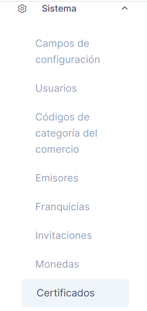

## ¿Qué son y para qué utilizar los certificados SSL?

En esta sección se crean los certificados SSL, los cuales son títulos digitales que vinculan digitalmente una clave criptográfica con los datos de una organización. Los certificados SSL permiten autenticar la identidad de un sitio web y cifrar la información que se envía al servidor.
El certificado permite que cuando un usuario intente enviar información de las credenciales al servidor web, el navegador del usuario accederán al certificado digital del servidor para establecer una conexión segura. De esta forma, estos certificados proveen seguridad a los datos manejados en ACS.

La siguiente imagen muestra un ejemplo de la vista de un índice de certificados:

### Acciones para los certificados:

Los certificados se pueden editar y se pueden visualizar los detalles del mismo, haciendo clic en el menú con tres puntos ubicado en la parte lateral derecha de cada certificado, se desplegará un menú como el de la siguiente imagen:

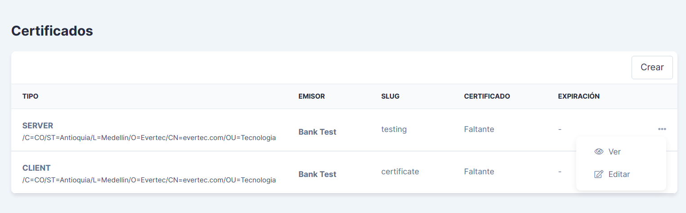
## Creación de un certificado:

Para crear un nuevo certificado en ACS, haga clic en el botón *Crear*. La solicitud o creación del certificado consta de tres partes:

#### 1. Creación de la llave privada:

1.1. Solicitud del tipo de llave con el cual se va a cifrar el certificado, están disponibles los siguientes tipos de llaves:

- **RSA,** es una llave creada a partir del algoritmo RSA, un sistema criptográfico de clave pública que utiliza factorización de números enteros y cifra bloques de datos. Es el algoritmo más utilizado para crear estas llaves.

> Una llave privada solo puede descifrarla la llave pública que se crea y que es asociada a una única llave privada.

- **EC,** es una llave basada en la Criptografía de curva elíptica (ECC), la cual promete una seguridad más fuerte y mejor rendimiento ya que utiliza claves más cortas. El sistema criptográfico utilizado está basado en las matemáticas de curvas elípticas.

> La llave es la que permite al usuario autenticarse por medio de la conexión SSH al servidor web. Para esto deberá contar con una llave privada y una llave pública que contiene el servidor y con la cual se va a conectar. 

1.2. Selección del tipo de cifrador para el certificado. Se debe seleccionar dependiendo del tipo de conexión y están disponibles dos tipos:

- **AES_128_CBC:** Es un tipo de cifrado, donde Advanced Encryption Standard (AES), es un esquema de cifrado por bloques y Cipher Block Chaining (CBC), es un modo de operación para una unidad de cifrado por bloques. Este tipo de cifrado tiene un tamaño de 128 bytes. Es el más utilizado.

- **AES_256_CBC:** Es un tipo de cifrado por bloques, que utiliza el modo de operación CBC. Este tipo de cifrado tiene un tamaño de 256 bytes.

3. Tamaño de la llave en bits.

4. Contraseña de la llave.

5. Tipo de llave. La llave va a funcionar para un cliente, un servidor o un SDK.

6. Banco emisor.

7. Tipo de franquicia.

#### 2. Solicitud de firma del certificado:

Aquí se registran los datos de información general sobre el solicitante de la llave:

- **País:** Seleccione el país donde se crea el certificado de la lista desplegable.

- **Estado:** Ingrese el nombre del estado del país en el cual está ubicado.

- **Localidad:** Ingrese el nombre de la ciudad en el cual está ubicado.

- **Nombre de la organización:** Ingrese el nombre de la organización para la cual se crea el certificado.

- **Nombre de la unidad organizacional:** Ingrese el nombre del área de la organización para la cual se genera el certificado.

- **Nombre común:** Ingrese un nombre de dominio válido, siendo este el título o nombre de la página web de la organización.

- **Correo electrónico:** Ingrese la dirección de correo electrónico del solicitante del certificado.

#### 3. Información de rastreo:

Permite la identificación a partir de un slug, el cual forma parte de la URL que se va a consultar para acceder al servidor mediante el certificado.

## Registro y firma del certificado:

Una vez creado el certificado, le mostrará una vista como la siguiente:

En la primera sección, se observan los datos que ingresó en el formulario para la creación de la llave privada.

En la segunda sección, se presenta un bloque de texto cifrado que representa el CSR o solicitud de firma del certificado, necesario para la firma y creación del certificado SSL.

En la tercera sección, se da la opción de registrar el certificado obtenido, luego de que lo firme con su entidad certificadora.

#### ¿Cómo firmar el certificado?

1. Debe copiar este bloque, correspondiente a la solicitud de firma del certificado. Copie el bloque incluyendo las etiquetas de "---BEGIN CERTIFICATE REQUEST---" y "---END CERTIFICATE REQUEST---". 

2. Diríjase a su entidad certificadora y firme el certificado con el bloque de texto que copió correspondiente al CSR.

3. Al finalizar el proceso de firma del certificado, obtendrá un bloque de texto similar al primero que copió. Copie este bloque, incluyendo también las etiquetas de "---BEGIN CERTIFICATE REQUEST---" y "---END CERTIFICATE REQUEST---". Este bloque de texto corresponde al certificado en sí.

4. En el detalle del certificado, al final encontrará la opción de registrar su certificado, haga clic en el enlace con el nombre *Aquí!*.

5. Esto lo direccionará a la siguiente vista, donde debe pegar el segundo bloque de texto que copió, el cual corresponde a su certificado, en el campo *Certificado*, así:

6. Haga clic en guardar y con esto obtiene un certificado firmado válido para asegurar la transferencia de información con ACS.

<!--
type: tab
title: Importes
-->

# Importes

Para acceder al módulo de importes, diríjase al menú lateral izquierdo, despliegue la opción *Sistema* y busque la sección de *Importes* en los títulos.

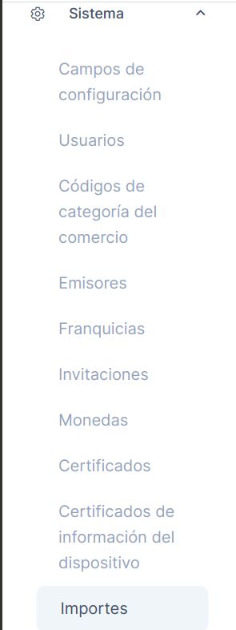

En esta sección se pueden visualizar las importaciones de archivos realizadas en ACS, por ejemplo se encuentran los archivos que importan un listado de rangos de tarjetas para un emisor, también los archivos de importación de listas de control de fraude.

## Índice de importes:

En este índice de importes puede visualizar los detalles de cada importe y el estado en el cual se encuentra la importanción.

Los estados posibles son:

- Completado
- Fallido
- Pendiente

<!--
type: tab
title: Reportes
-->

# Reportes

Para acceder al módulo de reportes, diríjase al menú lateral izquierdo, despliegue la opción *Sistema* y busque la sección de *Reportes* en los títulos.

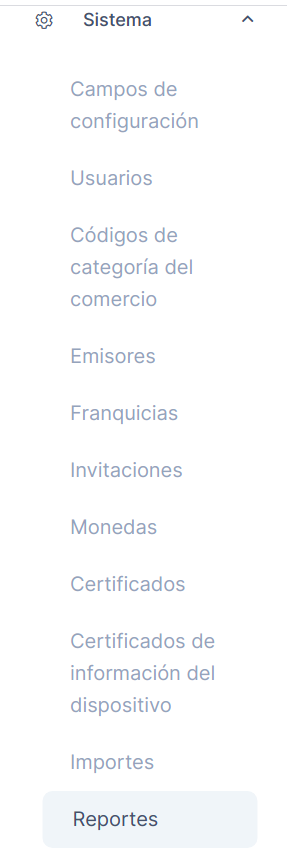

## Índice de reportes:

Los reportes son archivos que contienen registros de las autenticaciones procesadas por ACS. La siguiente imagen muestra un ejemplo de la vista con el índice de reportes generados. Estos reportes se pueden ver y descargar los archivos con toda la información de los mismos.

## ¿Cómo crear nuevos reportes?

Para crear un nuevo reporte haga clic en el botón *Crear*. 
Actualmente se manejan dos tipos de reportes:

### Reportes de Autenticaciones

El sistema de reportes permite generar un archivo con el reporte de las autenticaciones procesadas por ACS. Para el reporte se puede definir un rango de fechas, identificador de la transacción, BIN de tarjetas, banco emisor y uno o varios estados de las autenticaciones que se desean registrar en el reporte. El siguiente es un ejemplo de creación de un reporte de autenticaciones:

### Reportes de Abandonos 

Con este reporte se generan los datos de las autenticaciones que son abandonadas en el ACS. Para el reporte se puede definir un rango de fechas y el banco emisor. El siguiente es un ejemplo de creación de un reporte de abandonos:

## Tipos de archivos generados para los reportes
- Archivo separado por comas.
- Archivo separado por tabuladores.
- Archivo de Excel

<!--
type: tab
title: Invitaciones
-->

# Invitaciones de usuarios

Para acceder al módulo de invitaciones, diríjase al menú lateral izquierdo, despliegue la opción *Sistema* y busque la sección de *Invitaciones* en los títulos.

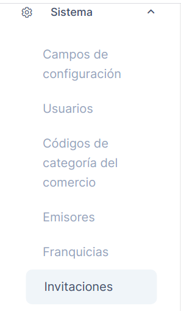

En este módulo se gestionan las invitaciones que realiza un usuario registrado en ACS a otro usuario que desea utilizar la aplicación.

## Invitaciones para crear nuevos usuarios de ACS:

Es a través de una invitación que se pueden crear nuevos usuarios, esta se envía a un correo y allí redirecciona al usuario al inicio de sesión gestionado por la aplicación de Accounts, creada en PlacetoPay, en esta redirección el usuario podrá registrarse y acceder.

> Los datos que registre deben ser los mismos que se utilizaron para enviar la invitación.

## ¿Cómo crear una invitación?

Para crear una invitación, haga clic en el botón *Crear* del módulo de invitaciones, visualizará un formulario como el siguiente:

Datos a diligenciar:

- **Nombre:** Corresponde al nombre que va a identificar al nuevo usuario.

- **Correo electrónico:** Debe ser un correo válido porque allí es dónde se enviará la invitación.

- **Perfil:** Seleccione el perfil que desea otorgarle al nuevo usuario.

<!--
type: tab
title: Usuarios
-->

# Usuarios

Para acceder al módulo de usuarios, diríjase al menú lateral izquierdo, despliegue la opción *Sistema* y busque la sección de *Usuarios* en los títulos.

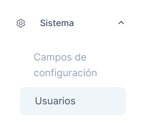

## Listado de usuarios:

En este módulo se puede visualizar el listado de usuarios con acceso a ACS. El listado contiene el nombre y el correo electrónico asociado al usuario.

> Es importante recordar que los usuarios se crean a través del módulo invitaciones y solo aparece en este módulo, cuando haya aceptado la invitación para unirse a ACS, creado el usuario y haya iniciado sesión sin conflicto alguno.

El siguiente es un ejemplo de una vista del módulo usuarios.

<!-- theme: warning -->

> Los usuarios no se pueden eliminar ni editar.

<!--
type: tab
title: Campos de configuración
-->

# Campos de configuración

Para acceder al módulo de campos de configuración, diríjase al menú lateral izquierdo, despliegue la opción *Sistema* y busque la sección de *Campos de configuración* en los títulos.

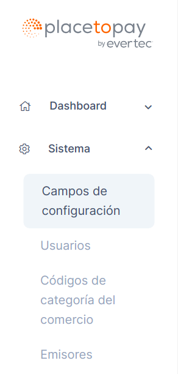

## Índice y acciones de los campos de configuración:

En este módulo se gestionan los campos de configuración para los emisores. En el índice del módulo se visualiza el listado de los campos organizados en una tabla.

Estos campos permiten configurar el funcionamiento y la validación de los datos a recibir en la interfaz de usuario del desafío para las autenticaciones con challenge.

### Acciones para los campos:

Entre las acciones disponibles para los campos de configuración están:

- Habilitar / Deshabilitar
- Editar
- Ver
- Crear

Aquí un ejemplo del índice de campos con sus acciones desplegadas.

## Detalles de los campos de configuración:

Un ejemplo de la vista del detalle de un campo de configuración es el siguiente:

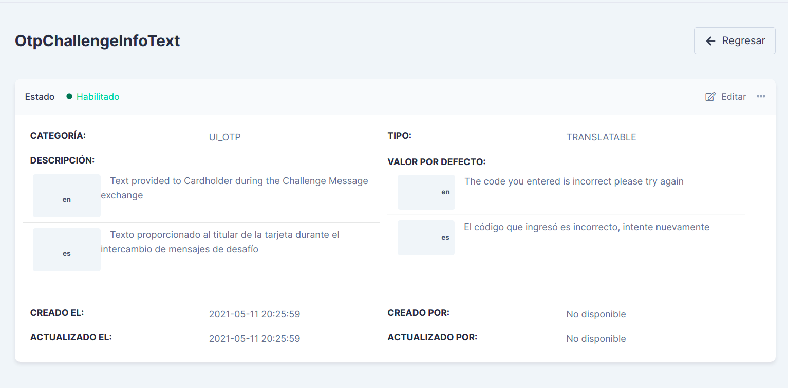

En él se puede visualizar el estado del campo, la categoría,el tipo, la descripción del campo y su traducción, el valor que se asigna al campo y los datos de creación y actualización del campo.

## Creación de un nuevo campo de configuración:

Para crear un nuevo campo de configuración, haga clic en el botón *Crear* ubicado en el índice de *Campos de configuración*, en la parte lateral derecha.

Al presionar el botón crear, lo primero que solicita y se debe seleccionar, es el tipo de dato del campo, como se visualiza en la siguiente imagen: 

### Tipos de datos de un campo:

- **SELECT:** Recibe un dato que se ha seleccionado de una lista de valores disponibles.

- **BOOLEAN:** Recibe únicamente las opciones de falso y verdadero.

- **DATE:** Recibe una fecha con un formato dado.

- **NUMERIC:** Recibe valores numéricos.

- **STRING:** Recibe un dato que puede incluir cadena de texto, números y signos.

- **PASSWORD:** El dato que se recibe en este campo es guardado de forma segura. SU valor original suele reemplazarse con carácteres especiales o con un algoritmo de criptografía.

- **TRANSLATABLE:** Recibe un dato que puede ser traducido.

> Según el tipo de dato escogido se mostrará un formulario diferente para la creación del campo.

### Fomulario de creación:

Luego de seleccionar el tipo de dato del campo, visualizará el formulario, para este ejemplo se seleccionó el tipo de campo *BOOLEAN*, para el cual obtendrá un formulario como el siguiente:

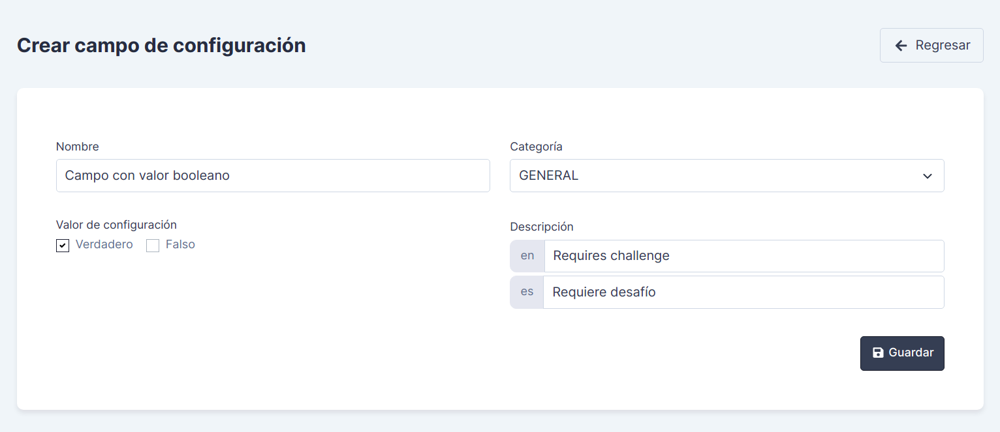

En el formulario se solicitan los siguientes datos:

- **Nombre:** Ingrese el nombre para el campo a crear.

- **Categoría:** Seleccione la categoría para la cual desea que opere el campo a crear.

  Las categorías disponibles son las siguientes:

  - **GENERAL:** Los campos creados en esta categoría aplican para todos los tipos de interfaces de usuario utilizadas en el desafío de la autenticación.

  - **UI_OTP:** En esta categoría se almacenan los campos que validan el desafío con una interfaz de usuario para OTP (código de un solo uso), en la cual el usuario visualiza un campo en el cual debe ingresar el código OTP que recibió.

  - **UI_SINGLE_SELECT:** En esta categoría se almacenan los campos que validan el desafío con una interfaz de usuario diseñada para que se seleccione una única opción para el desafío. Por ejemplo, se pregunta al tarjetahabiente si prefiere el OTP que se enviará al dispositivo del consumidor o a la dirección de correo electrónico registrada.

  - **UI_MULTI_SELECT:** En esta categoría se almacenan los campos que validan el desafío con una interfaz de usuario diseñada para seleccionar múltiples opciones para realizar el desafío solicitado y obtener a su vez, múltiples respuestas en una sola pantalla. Por ejemplo, se pregunta al usuario en qué ciudades ha vivido, para lo cual se le ofrecen múltiples opciones que pueda seleccionar.

  - **UI_OOB:** En esta categoría se almacenan los campos que validan el desafío con una interfaz de usuario fuera de banda (OOB), la cual permite a los emisores utilizar otros métodos de autenticación como por ejemplo la aplicación móvil de un emisor. De esta forma, en la interfaz de usuario el emisor proporciona instrucciones al tarjetahabiente para explicar el proceso de autenticación con desafío que debe realizar.

  - **SERVICES:** En esta categoría se almacenan los campos que validan las estrategias a utilizar para implementar servicios del ACS como el OTP o el servicio de información del tarjetahabiente.

- **Valor de configuración:** Ingrese o seleccione el valor que desea que tenga el campo. Este valor se toma como el valor por defecto y con el cual se inicializa el campo de configuración, posteriormente puede editar tal valor.

  Para el ejemplo al hacer un campo de tipo booleano, solo acepta valores de sí, no, verdadero o falso. Haga check en el valor con el cual desea configurar el campo.
  

- **Descripción:** Ingrese en el campo con prefijo *en* la descripción de la función del campo en inglés, y para el prefijo *es*, ingrese la descripción de la función del campo en español.

<!--
type: tab
title: Monedas
-->

# Monedas utilizadas en ACS

Para acceder al módulo de monedas, diríjase al menú lateral izquierdo, despliegue la opción *Sistema* y busque la sección de *Monedas* en los títulos.

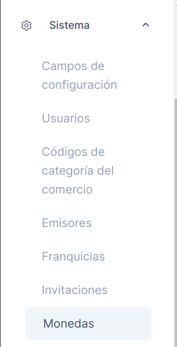

## Índice de monedas:

En esta sección se visualiza el índice o listado de las monedas creadas para utilizarse en ACS. La información se encuentra organizada en una tabla y muestra los datos más relevantes de las monedas como son: Nombre, Código alfabético, Código numérico y Estado.

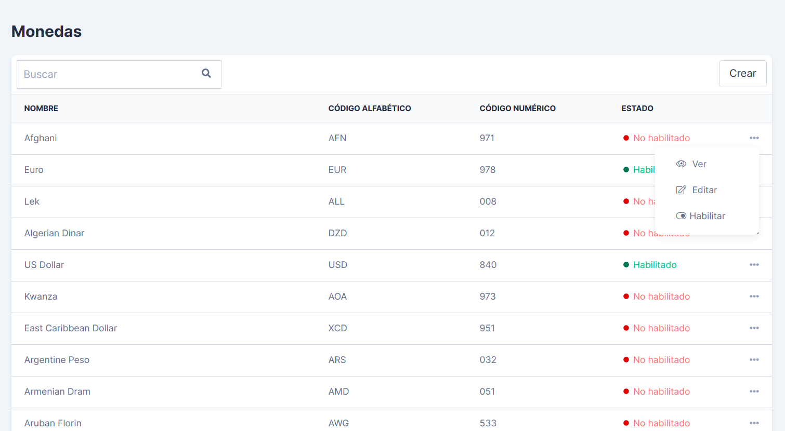

## Acciones para las monedas:

En el índice de monedas puede acceder a las acciones disponibles para las monedas: 

- Puede visualizar los detalles de cada moneda haciendo clic en la opción *Ver*.

- Puede editar la información con la cual creó las monedas, haciendo clic en la opción *Editar*. 

- Puede habilitar o deshabilitar las monedas, deslizando el botón tipo switch con nombre *Habilitar* cuando está deshabilitada la moneda, o con nombre *Deshabilitar* cuando está habilitada y desea deshabilitarla. Utilice esta función acorde con las necesidades del territorio donde se utilizarán los servicios de ACS.

Para acceder a esta funciones, diríjase al menú con tres puntos ubicado al final de cada registro de moneda en la tabla.

## ¿Cómo crear una nueva moneda?

Para crear una nueva moneda, debe diligenciar un formulario similar al siguiente:

Datos a diligenciar:

- **Nombre:** Nombre por el cual se reconoce a la divisa que va a crear.

- **Código alfabético:** Para este campo debe buscar el código alfabético correspondiente a la moneda que va a crear. El código debe ser el establecido por el estándar internacional ISO. Este contiene tres carácteres.

- **Código numérico:** Para este campo debe buscar el código numérico correspondiente a la moneda que va a crear. El código debe ser el establecido por el estándar internacional ISO y consta de tres dígitos.

- **Unidad menor:** Ingrese un número que indique la menor denominación o el menor valor que puede tener la moneda que está creando.

<!--
type: tab
title: Códigos del comercio
-->

# Códigos de categoría del comercio

Para acceder al módulo de monedas, diríjase al menú lateral izquierdo, despliegue la opción *Sistema* y busque la sección de *Códigos de categoría del comercio* en los títulos.

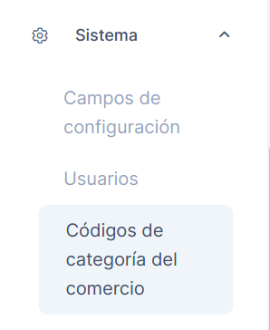

## Índice de códigos de categoría del comercio:

En esta sección se visualiza el índice o listado de los códigos relacionados con las categorías de los comercios a los cuales ACS les procesa autenticaciones. La información se encuentra organizada en una tabla y muestra los datos relevantes de los códigos como son el código numérico en sí y su descripción.

## Función del módulo:

Este módulo se pone a disposición del cliente a modo informativo y aclaratorio, ya que las autenticaciones en la recepción del mensaje *AReq* procesa un campo llamado *mcc* (Merchant Category Code), el cual contiene el código de categoría del comercio, un valor numérico de 4 dígitos que por sí mismo no es muy claro, así que este listado de códigos va a facilitar la aclaración del tipo de comercio y la descripción a la cual hace referencia el código.

## Acciones y creación de códigos de categoría del comercio:

La anterior imagen muestra un ejemplo de la vista del módulo, las funcionalidades que están disponibles son:

- **Búsqueda de códigos:** Mediante el recuadro de búsqueda ubicado en la parte superior izquierda de la pantalla, podrá buscar un código específico, puede buscar con un fragmento del código, el código completo o un fragmento de la descripción del código.

- **Edición y Eliminación:** En el menú ubicado al final de cada código se despliega una lista con los botones de editar y eliminar el código. Esta funcionalidad se utiliza según los requerimientos del cliente.

- **Creación de un nuevo código:** Para crear un nuevo código, haga clic en el botón *Crear* ubicado en la parte lateral derecha de la pantalla. Se presentará un formulario como el siguiente:

Diligencie teniendo en cuenta lo siguiente:

- **Código:** Ingrese un valor numérico de 4 dígitos que esté incluído en el listado en el ISO 18245, el cual es una normatividad encargada de la asignación de códigos de categoría de comerciantes para utilizarse en servicios financieros.

- **Descripción:** Se presentan dos campos, en el que contiene el prefijo *en*, ingrese la descripción en inglés para el código a crear, y en el campo con prefijo *es*, ingrese la misma descripción en español.

<!-- type: tab-end -->