<!--
type: tab
title: Autenticaciones
-->

# Autenticaciones

En este módulo se registra la información de todas las autenticaciones procesadas por el ACS. En la primera vista se encuentra el listado de las transacciones con fecha, estado y otros datos importantes. También, puede desplegar más información de cada transacción con el botón desplegable ubicado antes del botón *Ver*.

## Filtros:

Para buscar un listado o una transacción en específico puede utilizar los filtros. ACS cuenta con dos tipos de filtros para las autenticaciones, uno básico y otro avanzado para hacer consultas más rigurosas.

Para acceder a la funcionalidad, dé clic en el botón *Filtrar* ubicado en la parte lateral superior izquierda de la vista:

#### Filtros básicos:

La búsqueda se hace por:

- **Rango de fecha:** Debe dar clic en una fecha inicial del calendario y luego en otra fecha posterior a la primera (el rango no debe ser mayor a 60 días y no debe superar la fecha actual), luego dé clic en el botón negro para guardar el rango de fechas.

- **ID de la transacción:** Aquí se registra el identificador único de la transacción.

#### Filtros avanzados:

Al desplegar los filtros básicos, hay una opción *Ver filtros avanzados*, seleccionela y se desplegará una vista como la siguiente:

Aquí además de los dos filtros básicos, se pueden agregar más datos de búsqueda, tales como:

- BIN
- Últimos 4 dígitos del número de tarjeta
- Número de tarjeta
- Banco emisor
- Estado de la transacción

## Detalle de la autenticación:

En el detalle de la autenticación, el cual se puede visualizar dando clic en el botón *Ver* de una autenticación, se encuentra información esencial del proceso de autenticación, como el estado de la autenticación, la información básica de la transacción, la información del tarjetahabiente, del comercio, los datos de entrega y una línea de tiempo con los detalles de todo el proceso de autenticación y de la información captada por cada uno de los mensajes presentes en el proceso y correspondientes al protocolo 3-D Secure.

### Calificación:

Algunas autenticaciones cuentan con calificaciones que permiten darle un puntaje de seguridad. Este puntaje determina el nivel de riesgo de la transacción, teniendo en cuenta el historial de transacciones que poseen características similares.

### Información de entrega:

Aquí se visualiza la información relacionada con la ubicación en la cual se va a entregar el bien o servicio adquirido con la transacción. También, se puede visualizar un mapa con la ubicación.

### Gestión de disputas:

Las disputas son reclamaciones que realiza el cliente registrado con una autenticación en ACS, en la cual puede existir un caso de fraude. 

#### Crear una disputa:

Para crear una disputa, al inicio del detalle de una autenticación, haga clic en el botón *Generar nueva disputa*.

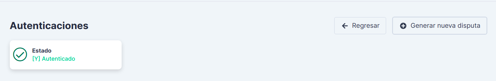

Posterior a esto, se agregará a la autenticación un caso de disputa abierta. Se visualizará como esta imagen:

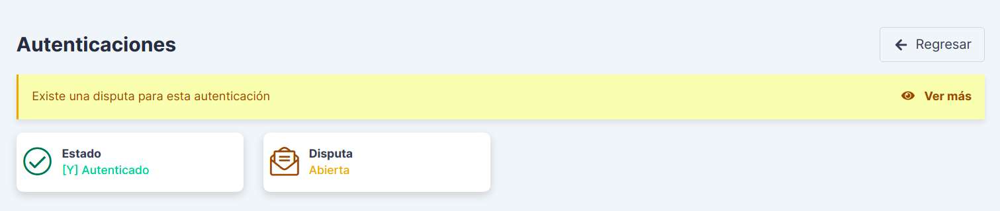

#### Detalle de una disputa:

Para visualizar el detalle de la disputa creada, de clic en la opción *Ver más*. Se direccionará a una sección de la misma vista, donde se gestionan las disputas para esa autenticación. 

Un ejemplo de detalle de una disputa es el siguiente:

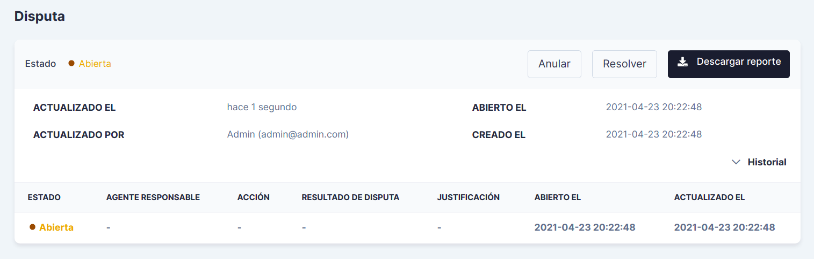

#### Historial de una disputa:
En el detalle de la disputa, en la parte lateral derecha, se puede visualizar el historial de la disputa haciendo clic en el botón desplegable *Historial*. Se mostrarán todos los movimientos que ha tenido una disputa, con sus respectivos estados, el agente responsable, la acción, la justificación y la fecha de apertura y actualización.

#### Reporte de disputas:
Puede descargar un reporte en formarto PDF con el histórico de las disputas y toda la información relacionada con la transacción y el proceso de autenticación. Para ello, haga clic en el botón *Descargar reporte*, que se encuentra en los detalles de la disputa en la parte lateral derecha.

#### Acciones para una disputa abierta:

Para una disputa en estado **Abierta**, se pueden tomar estas acciones: 

1. **Anular:** Haciendo clic en el botón *Anular*, se despliega una ventana para ingresar el motivo de la anulación de la disputa. Esta opción se toma cuando la disputa no es válida por algún motivo que se dejará registrado.

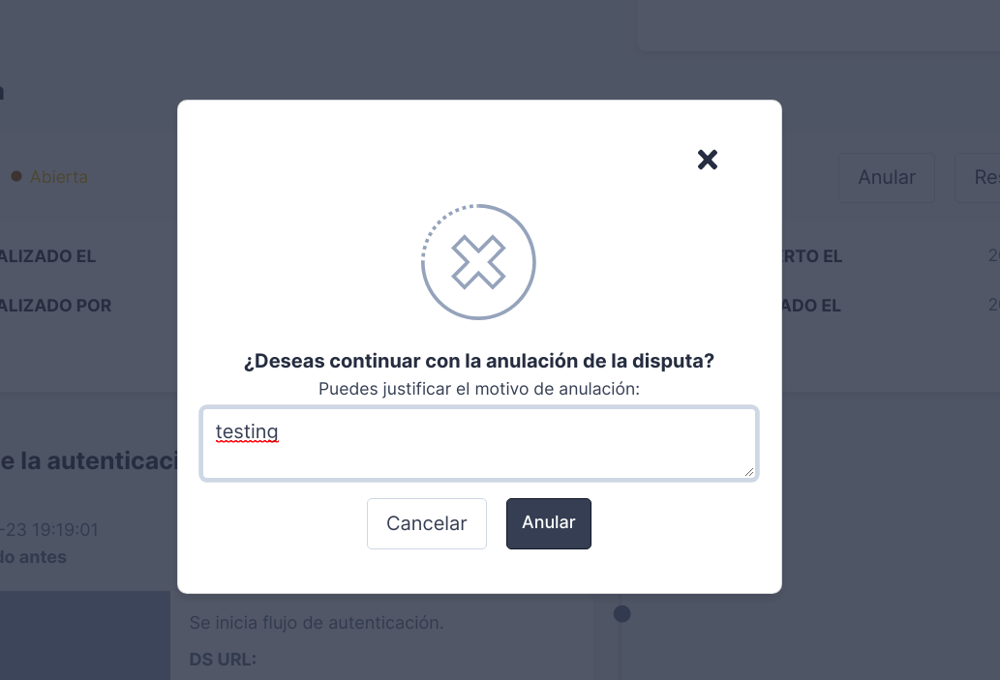

2. **Resolver:** Haciendo clic en el botón *Resolver*, se presentará un formulario como el siguiente, en el cual debe registrar los motivos para la resolución de la disputa. Esta opción se toma cuando ya se ha dado una respuesta por parte del banco emisor encargado de analizar el caso de disputa.

Diligencie el formulario teniendo en cuenta los siguientes datos:

- **Agente responsable:** Hace referencia al agente responsable de la causa que originó la disputa.

- **Resultado de disputa:** Este resultado se basa en la respuesta que ofrecen las instituciones encargadas de evaluar la disputa. Si el resultado dado no registra en la lista de opciones, debe elegir la opción *Otro* y describir el resultado al que se refiere.

- **Acción:** Aquí se debe seleccionar el agente que se va a hacer cargo de los resultados de la disputa.

- **Justificación:** En el cuadro de texto puede diligenciar las razones para la resolución de la disputa o información adicional que desee que quede registrada para el caso.

#### Acciones para disputas anuladas o cerradas:

Para una disputa en estado **Cerrada** o **Anulada**, se pueden tomar la siguiente acción: 

1. **Reabrir:** Esta acción esta disponible para disputas que se encuentren en los estados: Cerrada o Anulada. Al dar clic en esta opción, la disputa se pondrá nuevamente en estado Abierta y tendrá la posibilidad de anularla o resolverla.

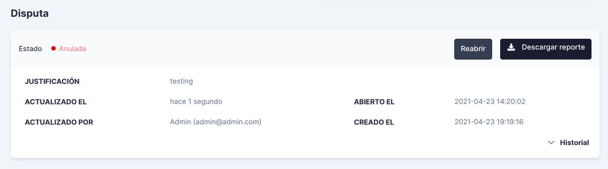

### Traza de la autenticación:

Cada autenticación tiene una traza, la cual se entiende en ACS como una línea secuencial que registra los pasos realizados en el proceso de autenticación, los datos que recibe, las peticiones y respuestas de los tipos de mensaje que procesa, los estados y descripción de errores si se presentan.

Este es un ejemplo de una traza de una autenticación exitosa:

Además, cada paso tiene la opción *Ver más*, la cual muestra la estructura de la petición o la respuesta con sus respectivos datos. Un ejemplo de este detalle es el siguiente:

<!--
type: tab
title: Disputas
-->

# Disputas

Como se menciona en el módulo de Autenticaciones, las disputas son reclamaciones que realiza un cliente por un posible caso de fraude en una transacción.

En esta sección se registran y listan las disputas que se procesaron para diversas autenticaciones. 

Aquí se pueden visualizar los detalles y descargar las disputas como un PDF.

### Reporte de disputas:

El archivo PDF generado para una disputa contiene el estado y el historial de la disputa, información básica de esta, información del tarjetahabiente, las trazas o pasos de la autenticación con sus respectivas peticiones y respuestas.

### Filtros:

Este módulo contiene también filtros que permitirán hacer búsquedas de disputas específicas, filtrando por agentes responsables de las disputas, acciones, identificadores de transacción, entre otros.

<!--
type: tab
title: Autenticaciones Desacopladas
-->

# Autenticaciones Desacopladas

En esta sección registran las autenticaciones que entraron a un proceso de desacople a cargo del banco
emisor para corroborar la identidad del tarjetabiente.

La sesion de *Autenticaciones desacopladas*, se divide en tres modulos, en los cuales se gestiona una
autenticación dependiendo de la acción que se va a realizar.

1. **Módulo Autenticaciones desacopladas:** En este módulo ingresan todas las autenticaciones que aún no se han desacoplado y están en espera de ser solucionadas por un usuario con permisos.

3. **Módulo Mis autenticaciones:** Cuando un usuario selecciona una autenticación del módulo de *Autenticaciones desacopladas*, estas se ubican en el presente módulo, permitiendo así, tener una buena organización y gestionar mejor las autenticaciones, al poder identificar fácilmente aquellas en las cuales ha trabajado. 

3. **Módulo Autenticaciones seleccionadas por otros usuarios:** Este módulo permite observar las autenticaciones seleccionadas por otro usuario. Aquí se debe tener en cuenta que una autenticación solo la puede resolver un usuario, aún así, pueden ser observadas por varios usuarios con el permiso de autenticar.

> La división de las autenticaciones desacopladas permite que los usuarios que las vayan a resolver tengan
una mayor organización, y no se presenten conflictos en el momento de resolverlas.

## Autenticación sin un usuario asignado

En el módulo de *Autenticaciones desacopladas*, se muestran las autenticaciones que no han sido seleccionadas por algún usuario. Por lo cual, para ser asignada, el usuario debe ingresar a la información de la autenticación, y el sistema se la asignará de manera automática para ser resuelta.

### Liberación de autenticaciones desacopladas:

Se debe tener en cuenta que si el usuario no desea resolverla, tendrá que liberarla a través de un clic en
el botón ubicado en el extremo derecho, con el nombre *Liberar*, así otro usuario la podrá resolver.

Cada autenticación cuenta con un tiempo promedio para ser resuelta, tiempo que se configura con el banco emisor. Si una autenticación no es resuelta en este tiempo, cambiará a un estado *U* = Autenticación no realizada. Se presentó un error técnico durante el proceso.

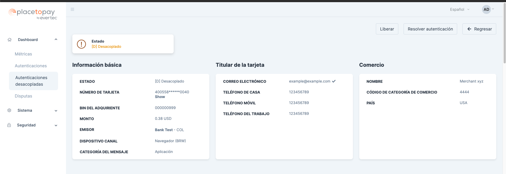

### Resolver autenticación:
La acción de resolver una autenticación la debe realizar un usuario con el conocimiento y permisos, teniendo en cuenta que el sistema solo muestra los datos de la transacción e información de ella.

Para autenticarla o no autenticar, se debe ingresar a través de un click en el botón de *Resolver autenticación*.
La aplicación muestra una ventana emergente con las dos opciones, el usuario selecciona uno de los
dos estados, luego envía su respuesta, el sistema reconoce la acción y cambia su estado e informa con un mensaje el cambio en la autenticación.

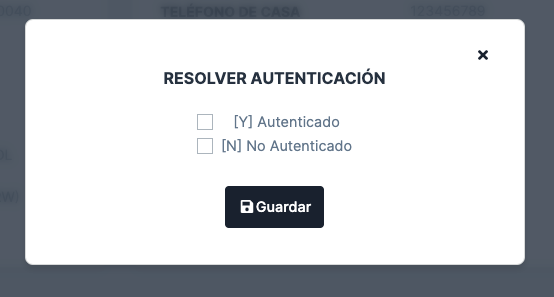

La aplicación muestra la información de la autenticación, con el cambio del estado en la parte superior
izquierda.

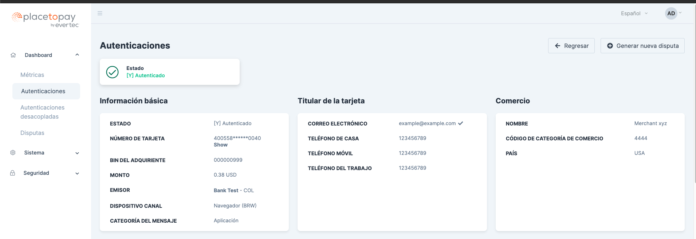

### Información de una autenticación:

#### Información básica: 

Dentro de este módulo se muestra la información básica de una autenticación. Esta es:

- Estado actual de la autenticación
- Número de la tarjeta (oculto), teniendo en cuenta que el usuario autorizado puede verla, sin embargo, el sistema informa al administrador principal la acción a través de un
correo, y guardando un log con la información del usuario.
- Bin del adquiriente
- Monto
- Emisor
- Dispositivo del canal
- Categoría del mensaje

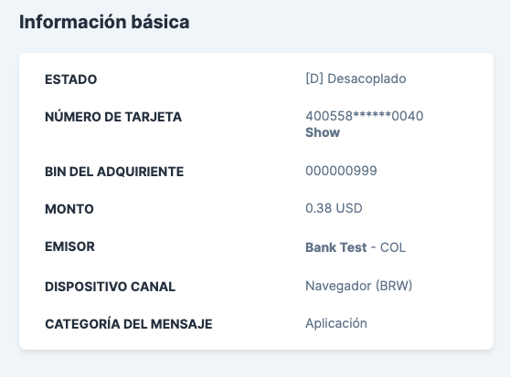

#### Titular de la tarjeta:

- Correo electrónico
- Teléfono de la casa
- Teléfono móvil
- Teléfono del trabajo

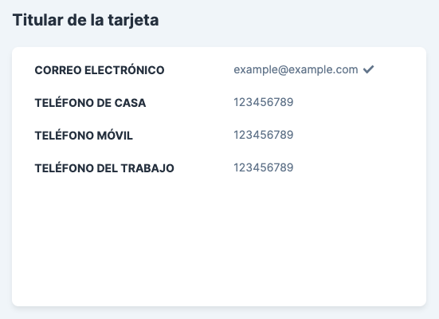

#### Información del comercio:

- Nombre del comercio
- Código de categoría de comercio
- Nombre del código de categoría de comercio
- País

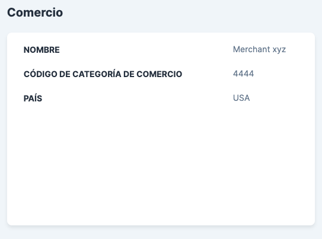

## Autenticación Relacionada

El presente módulo solo se puede observar cuando la autenticación se encuentra en un estado desacoplada, teniendo en cuenta que es información con datos comunes y sirve como historial de una autenticación semejante, por eso se muestra como una tabla, porque son
varias autenticaciones como respaldo de la actual. En algunos casos toda información es común, como en
otros casos solo tienen un dato en común.

La tabla se divide en:
- Comercio
- Emisor
- Monto
- Número de la tarjeta parcialmente oculto
- Correo electrónico
- Dispositivo del canal
- Flujo
- Estado

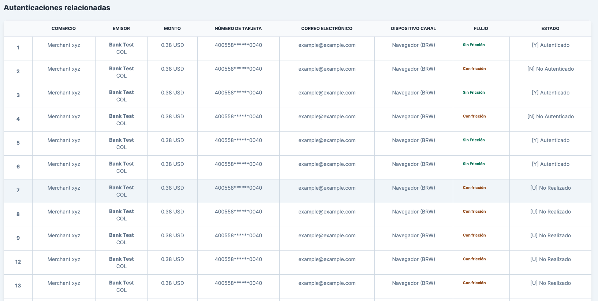

### Información de la cuenta del titular de la tarjeta:

Como el anterior módulo, este también solo se muestra en las
autenticaciones desacopladas. Contiene información del banco emisor como:

- Fecha de creación de la cuenta del titular de la tarjeta
- Indicador de edad de la cuenta del titular de la tarjeta
- Cambio de cuenta del titular de la tarjeta
- Cambio de contraseña de cuenta de titular de tarjeta
- Edad de cuenta de pago
- Indicador de edad de la cuenta de pago
- Indicador de cambio de cuenta del titular de la tarjeta
- Cantidad de transacciones por día
- Cantidad de transacciones por año
- Indicador de cambio de contraseña de cuenta del titular de la tarjeta
- Uso de la dirección de envío
- Cuenta de compra de la cuenta del titular de la tarjeta
- Indicador de nombre de envío
- Indicador de uso de la dirección de envío
- Número de intentos de aprovisionamiento por día
- Actividad de cuenta sospechosa

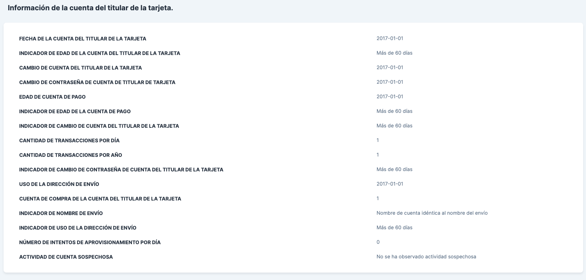

## Traza de la autenticación

En este módulo se presentan los mensajes de petición y de respuesta que se han presentado durante todo el flujo de la autenticación.

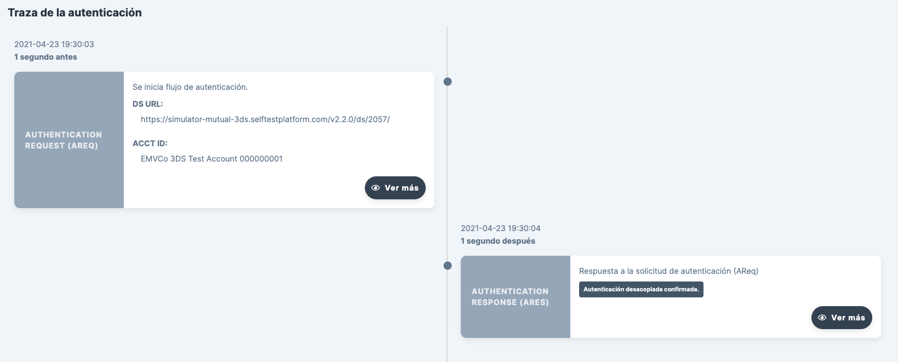

<!--
type: tab
title: Métricas
-->

# Métricas

Las métricas son estadísticas que reportan el comportamiento de la aplicación conforme al flujo de transacciones procesadas.

## Filtros:

Para mostrar en la gráfica de la métrica los datos específicos que se requieran, se debe hacer un filtro de las autenticaciones. Para acceder a los filtros haga clic en el botón *Filtrar*, ubicado en la parte superior lateral izquierda.

Para filtrar las transacciones se requieren los siguientes datos:

- Rango de fecha, seleccione una fecha inicial y una posterior en el calendario. Luego de clic en el botón negro para guardar el rango.

- Periodo.

- Moneda, divisa utilizada para las transacciones.

- Emisor, banco emisor que por el cual se procesó el grupo de transacciones.

ACS cuenta actualmente con los siguientes dos tipos de métricas:

## Métricas por monto de transacción

Esta métrica muestra en una gráfica el monto de las transacciones procesadas por el ACS, filtradas por un rango de fechas y diferenciadas por el estatus obtenido en la autenticación.

## Métricas por estado de transacción

Esta métrica muestra en una gráfica la cantidad de transacciones procesadas por el ACS, filtradas por un rango de fechas y diferenciadas por el estatus obtenido en la autenticación. 

Un ejemplo de métrica por estado de transacción, se presenta a continuación:

En la parte inferior puede visualizarse el rango de fecha con el cual se obtuvo la métrica y la cantidad de transacciones que cumplieron con los filtros.

> Para generar nuevas métricas, haga clic en el botón *Limpiar filtros* y genera un nuevo rango de fechas, moneda y emisor.

<!-- type: tab-end -->

