<!--
type: tab
title: Autenticaciones
-->

# Autenticaciones

En este módulo se registra la información de todas las autenticaciones procesadas por el ACS. En la primera vista se encuentra el listado de las transacciones, con fecha,estado y otros datos importantes. También, puede desplegar más información de cada transacción con el botón desplegable ubicado antes del botón *Ver*.

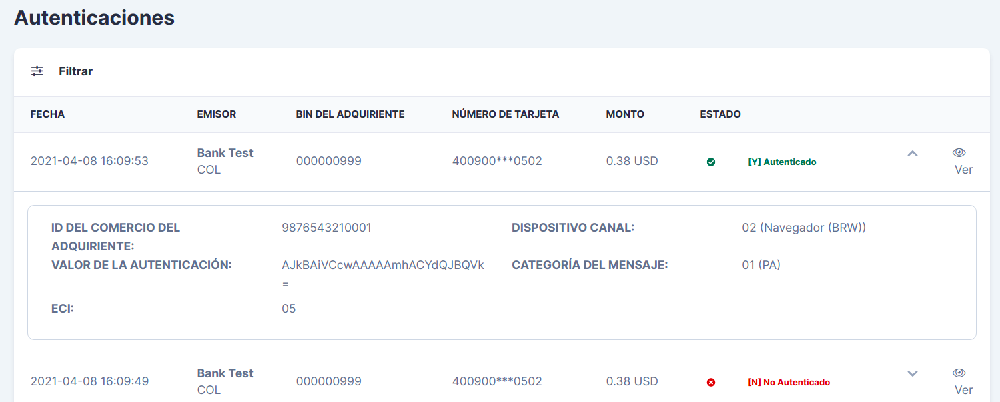

## Filtros:

Para buscar un listado o una transacción en específico puede utilizar los filtros. ACS cuenta con dos tipos de filtros para las autenticaciones, uno básico y otro avanzado para hacer consultas más rigurosas.

Para acceder a la funcionabilidad, dé clic en el botón *Filtrar* ubicado en la parte lateral superior izquierda de la vista:

#### Filtros básicos:

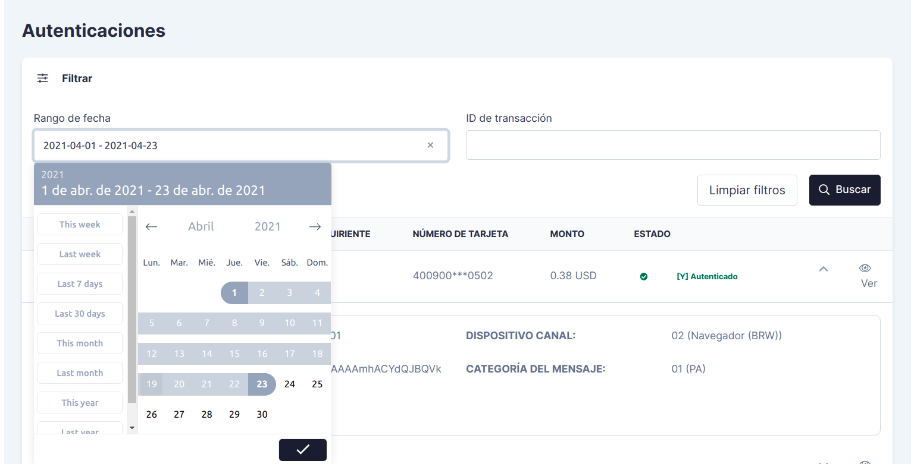

La búsqueda se hace por:

- **Rango de fecha:** Debe dar clic en una fecha inicial del calendario y luego en otra fecha posterior a la primera, luego dé clic en el botón negro para guardar el rango de fechas.

- **ID de la transacción:** Aquí se registra el identificador único de la transacción.

#### Filtros avanzados:

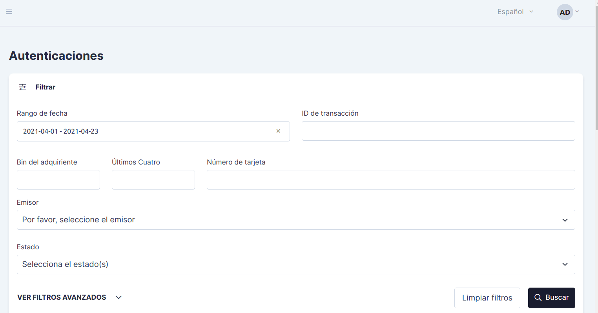

Al desplegar los filtros básicos, hay una opción *Ver filtros avanzados*, seleccionela y se desplegará una vista como la siguiente:

Aquí además de los dos filtros básicos, se pueden agregar más datos de búsqueda, tales como:

- BIN
- Últimos 4 dígitos del número de tarjeta
- Número de tarjeta
- Banco emisor
- Estado de la transacción

## Detalle de la transacción:

En el detalle de la transacción, el cual se puede visualizar dando clic en el botón *Ver* de una transacción, se encuentra información esencial del proceso de autenticación, como el estado de la autenticación, la información básica de la transacción, la información del tarjetahabiente, del comercio, la ubicación en el mapa de dónde se generó la transacción, los datos de entrega y una línea de tiempo con los detalles de todo el proceso de autenticación y de la información captada por cada uno de los mensajes presentes en el proceso y correspondientes al protocolo 3-D Secure.

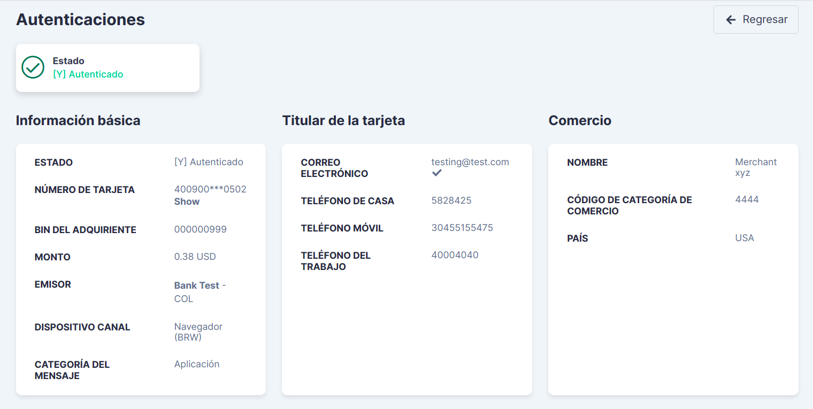

### Traza de la autenticación:

Cada autenticación tiene una traza, la cual se entiende en ACS como una línea secuencial que registra los pasos realizados en el proceso de autenticación, los datos que recibe, las peticiones y respuestas de los tipos de mensaje que procesa, los estados y descripción de errores si se presentan.

Este es un ejemplo de una traza de una autenticación exitosa:

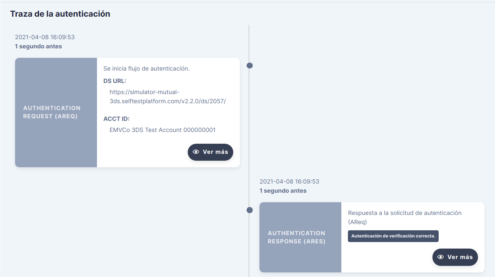

Además, cada paso tiene la opción *Ver más*, la cual muestra la estructura de la petición o la respuesta con sus respectivos datos. Un ejemplo de este detalle es el siguiente:

<!--
type: tab
title: Autenticaciones Desacopladas
-->

# Autenticaciones Desacopladas

En esta sección registran las autenticaciones que entraron a un proceso de desafío desacoplado a cargo del banco emisor para corroborar la identidad del tarjetabiente. 
Se detalla la fecha, el emisor, el BIN, número de tarjeta, monto y tiempo restante para la aprobación de la autenticación. Aquí se da la opción de resolver las autenticaciones manualmente, con base en el análisis de la información dada.

La siguiente es un ejemplo de vista inicial para la sección de autenticaciones desacopladadas:

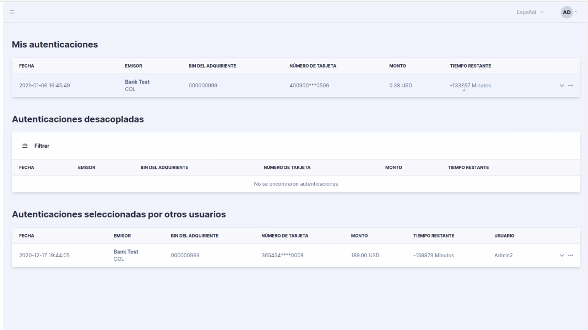

<!--
type: tab
title: Métricas
-->

# Métricas

Las métricas son estadísticas que reportan el comportamiento de la aplicación. En ACS se cuenta actualmente con los siguientes dos tipos de métricas:

## Filtros:

Para mostrar en la gráfica de la métrica los datos específicos que se requieran, se debe hacer un filtro de las autenticaciones. Para el filtro se pueden agregar los siguientes datos:

- Rango de fecha, seleccione una fecha inicial y una posterior en el calendario. Luego de clic en el botón negro para guardar el rango.

- Periodo.

- Moneda, divisa utilizada para las transacciones.

- Emisor, banco emisor que por el cual se procesó el grupo de transacciones.

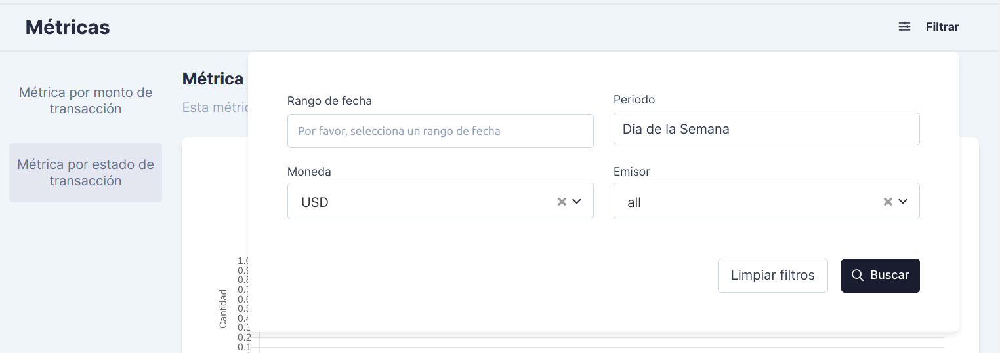

## Métricas por monto de transacción

Esta métrica muestra en una gráfica el monto de las transacciones procesadas por el ACS, filtradas por un rango de fechas y diferenciadas por el estatus obtenido en la autenticación.

## Métricas por estado de transacción

Esta métrica muestra en una gráfica la cantidad de transacciones procesadas por el ACS, filtradas por un rango de fechas y diferenciadas por el estatus obtenido en la autenticación.

<!--
type: tab
title: Emisores
-->

# Emisores

En la sección de emisores se encuentran diferentes funcionabilidades relacionadas con los emisores, siendo estos las instituciones financieras que se encargan de emitir tarjetas de pago y servicios relacionados con estas tarjetas.

En la siguiente imagen se visualiza un ejemplo de la vista de *Detalles del emisor*, además se puede editar y habilitar o deshabilitar con el menú lateral derecho.

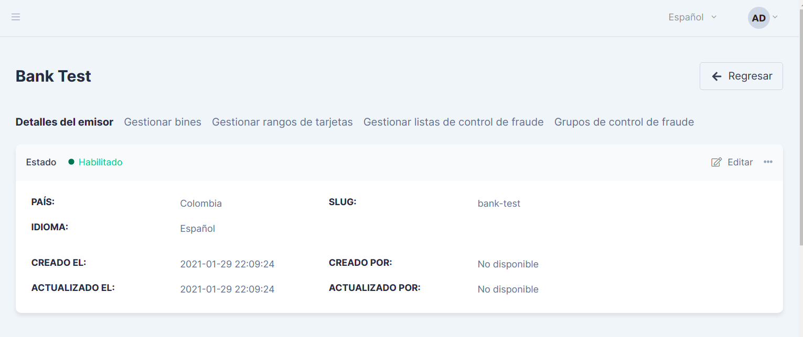

### Configuraciones:
En este apartado se encuentra toda la gestión de configuración de campos para un banco emisor, puede ver los detalles de cada uno, qué función desempeña, puede editarlos, deshabilitarlos y habilitarlos según se requiera. 

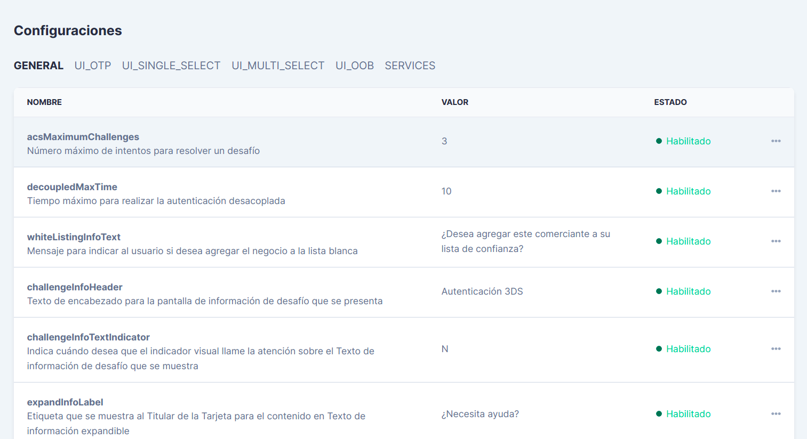

También, en la pestaña *Services*, se encuentran las estrategias disponibles para ejecutar los servicios para el emisor.

- otpStrategy, información acerca de cómo se va a implementar el servicio del OTP (Autenticación con contraseña de un solo uso).

- cardholderStrategy, información acerca de cómo se va a implementar el servicio de información del tarjetabiente.

#### Campos de configuración:

Estas configuraciones se gestionan desde la sección *Campos de configuración* del ACS. Allí se encuentra un listado de los campos creados para configurar los emisores, puede habilitarlos, deshabilitarlos, editarlos y ver sus detalles.

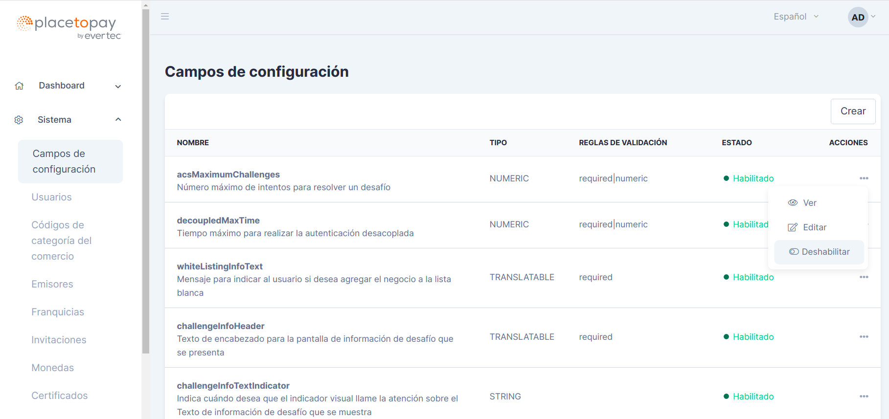

Además, con el botón *Crear*, puede adicionar nuevos campos con diferentes tipos de datos a recibir:

- **SELECT:** Recibe un dato que se ha seleccionado de una lista de valores disponibles.

- **BOOLEAN:** Recibe únicamente las opciones de falso y verdadero.

- **DATE:** Recibe una fecha con un formato dado.

- **NUMERIC:** Recibe valores numéricos.

- **STRING:** Recibe un dato que puede incluir cadena de texto, números y signos.

- **PASSWORD:** El dato que se recibe en este campo es guardado de forma segura. SU valor original suele reemplazarse con carácteres especiales o con un algoritmo de criptografía.

- **TRANSLATABLE:** Recibe un dato que puede ser traducido.

### Gestión de bines:
Aquí se gestionan los bines del adquiriente. En primer lugar obtendrá un listado de los bines creados anteriormente para el emisor, además puede crear otros bines nuevos, editarlos y eliminarlos.

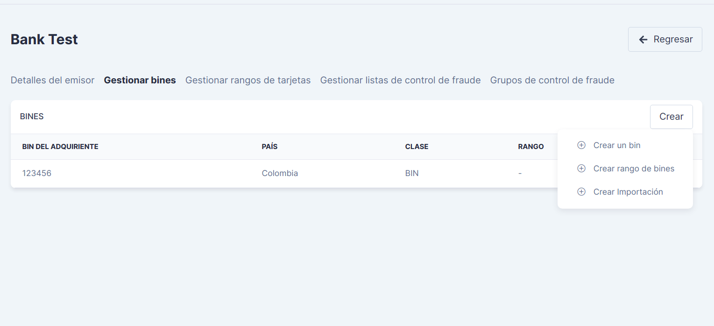

Al dar clic en el botón *Crear* como ilustra la imagen, tendrá tres opciones para crear bines:

- Crear un único BIN para el emisor.
- Crear un rango de bines para el emisor, el cuál contendrá un valor mínimo y un valor máximo de bines, creando así un grupo de números de tarjetas de crédito a gestionar.
- Crear importación, para la importación se aceptan los formatos de archivo .csv, .tsv y .txt

### Gestión de rangos de tarjetas:
En esta sección se importan y crean los rangos de tarjetas aceptadas para un emisor específico. Puede ver los detalles de cada rango, editarlos y eliminarlos.

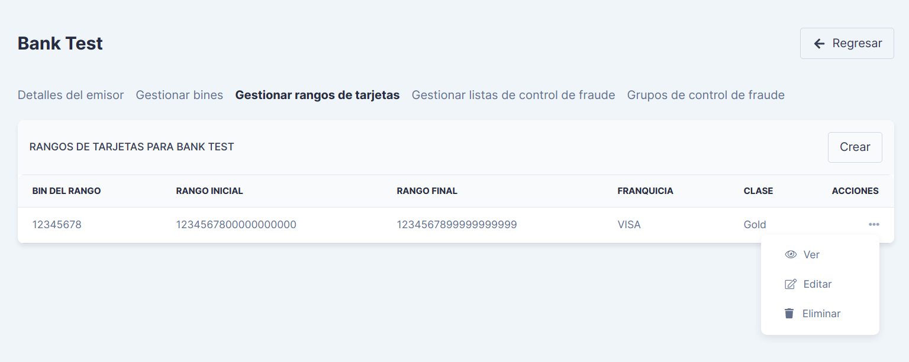

Al dar clic en el botón *Crear*, se desplegarán dos opciones para crear rangos:

- **Crear un rango de tarjetas,** este permite crear un rango de forma manual, se solicitará el BIN para el rango, el cual debe ser de 8 dígitos, el valor inicial y el final, la franquicia y la clase o tipo de las tarjetas asociadas al rango.

- **Crear importación,** para crear una importación visualizará un formulario similar al siguiente:

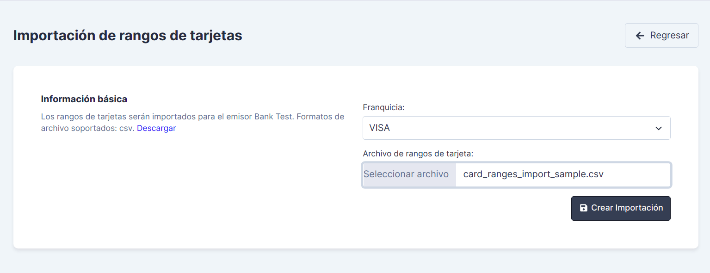

Debe seleccionar la franquicia para la cual se van a cargar los rangos y un archivo de tipo CSV (archivo de valores separados por comas) que contenga la información de los rangos. Un ejemplo del archivo es este:

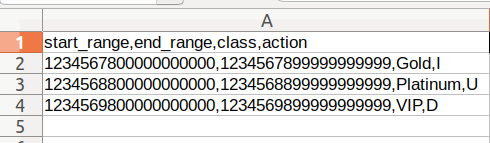

El archivo debe contener cuatro títulos separados por comas en minúscula:

1. **start_range**: Indica el valor inicial para el rango de tarjetas.

2. **end_range**: Indica el valor final para el rango de tarjetas.

3. **class**: Hace referencia a la clase o tipo de tarjeta utilizada, por ejemplo si es Gold, Platinum.

4. **action**: Debe indicar qué acción se debe ejecutar para el rango indicado, las acciones posibles y sus indicadores son los siguientes:

    **I**: Indicador para acción de insertar rango.

    **U**: Indicador para acción de actualizar rango .

    **D**: Indicador para acción de eliminar rango.

Estos títulos deben seguirse de sus respectivos valores en filas hacia abajo, igualmente separados por comas, sin espacios.

> Para visualizar el formato de un archivo CSV de ejemplo, haga clic en la opción *Descargar* que aparece en el lado izquierdo del formulario.

### Gestión del control de fraude:
Estas funcionabilidades están descritas detalladamente en la sección de *Motor Antifraude*. Aquí se hace la gestión de las reglas y de los grupos donde están contenidas, las cuales permiten validar los datos que llegan al ACS y garantizar la seguridad de la información, lo cual permitirá aceptar las solicitudes de autenticación que sean realmente válidas y tener filtros que permitan optimizar este proceso de validación.

<!--
type: tab
title: Motor Antifraude
-->

# Motor de Control de Fraude

La principal funcionabilidad de ACS es el motor de control antifraude, este permite validar la información que se recibe en la petición de autenticación, a través de un conjunto de reglas que se procesan mediante grupos específicos creados para validar las autenticaciones de cada emisor registrado.

Esta funcionabilidad se gestiona desde la sección de Emisores de la aplicación.

### Grupos de control antifraude:

Para cada banco emisor registrado en el ACS, se creará un grupo predeterminado conformado por una serie de reglas antifraude que permiten validar las solicitudes de autenticación. Además de este grupo prederteminado, se podrán agregar otros nuevos al emisor.

En la imagen se muestra el listado de grupos de control de fraude de un emisor. En esta vista se pueden crear nuevos grupos con el botón *Crear* y se pueden visualizar los detalles y las reglas de cada grupo dando clic en la opción *Ver*.

En la imagen ejemplo, se visualizan dos grupos, uno llamado *Lista blanca*, donde se podrían incluir por ejemplo números de tarjetas y datos de clientes con bajo riesgo de fraude y las acciones de las reglas podrían ser en su mayoría *Autenticar*. El otro grupo se llama *Lista negra*, aquí se podrían agregar los números de tarjeta e información personal asociada a clientes con historiales o reportes y la acción de las reglas podría ser *No autenticar*.

### Reglas antifraude:

Los grupos de control antifraude están conformados por reglas que permiten hacer las validaciones de los datos recibidos en las autenticaciones. Estas reglas evalúan la coincidencia de las condiciones contenidas en la regla y de los datos obtenidos en la solicitud de autenticación.

Al presionar la opción *Ver* de un grupo de control antifraude, le mostrará una vista similar a esta.

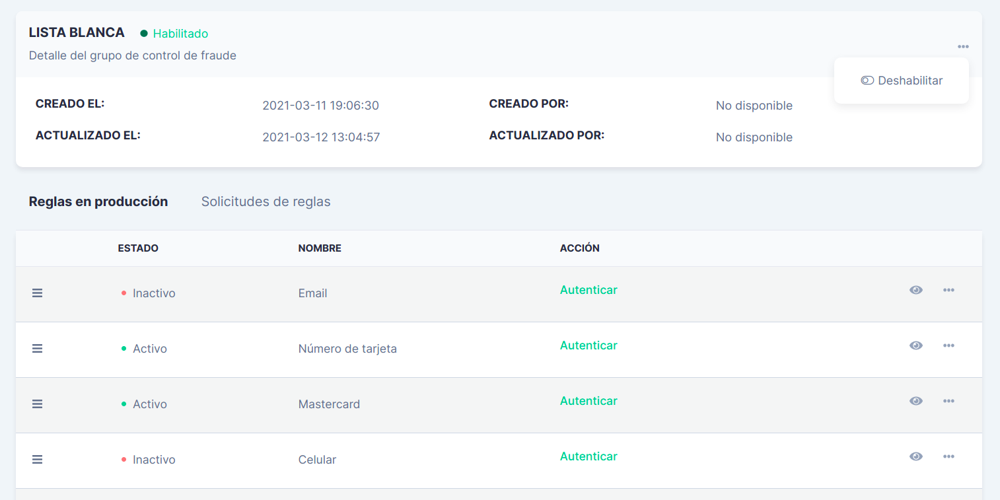

Aquí se encuentran los detalles del grupo seleccionado, puede habilitarlo o deshabilitarlo en el menú lateral derecho. Además, encontrará el listado de reglas correspondientes al grupo, la acción que ejecutan, puede habilitarlas o deshabilitarlas y puede visualizar los detalles y condiciones de la misma.

En la pestaña *Solicitudes de reglas*, se pueden visualizar las peticiones de creación, actualización o eliminación de reglas, las cuales se encuentran pendientes por aprobar o denegar. También, puede crear una petición de reglas nueva, haciendo clic en el botón *Crear petición de regla*.

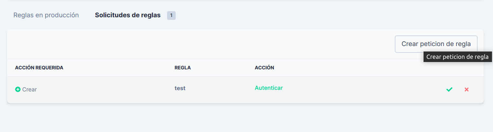

Luego visualizará una ventana como esta, dónde le solicitan la acción que desea hacer con la regla.

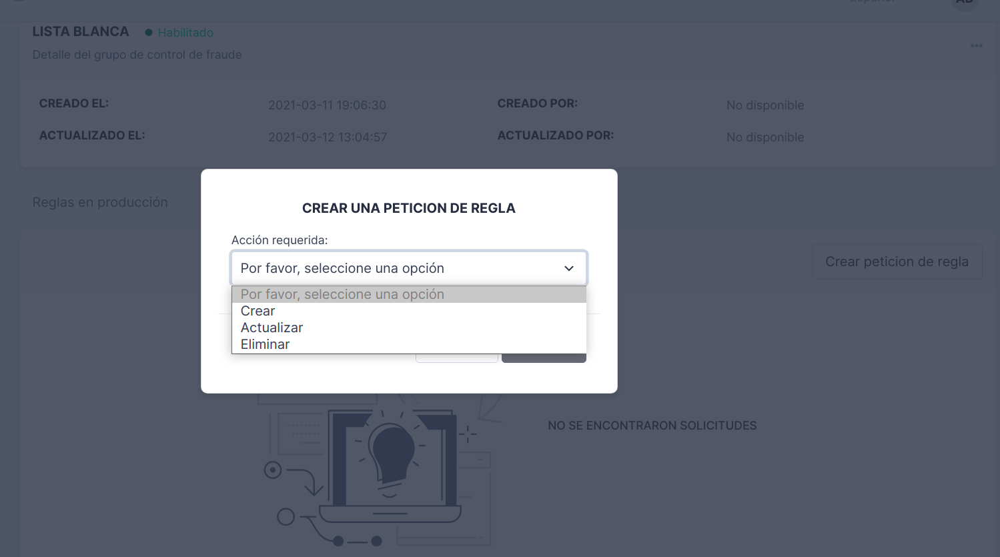

Para crear una petición de regla, debe seleccionar la opción *Crear*, y se desplegará una vista como la siguiente:

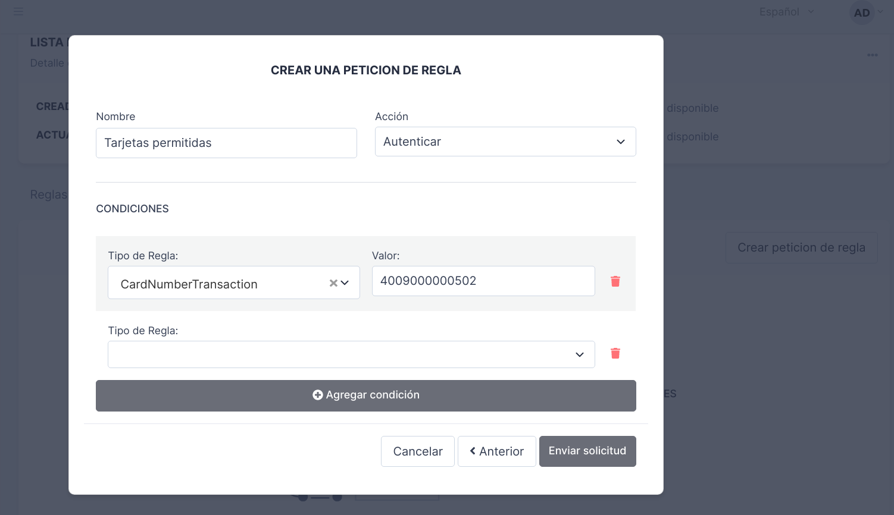

Los datos requeridos son:
- **Nombre:** ¿Cómo desea nombrar la regla a crear?
- **Acción:** Se refiere a la función que va a cumplir la regla en el proceso de autenticación. Estas acciones se describen detalladamente en el siguiente título.
- **Tipo de regla:** Hace referencia al tipo de regla que desea crear, por ejemplo es una regla que valida números de tarjeta de crédito, o valida emails, o rangos de bines...
- **Valor:** Es el valor que requiere una regla para validar y comparar los datos presentes en la misma y en la solicitud de autenticación.

> Puede además agregar otras condiciones para una misma regla.

También hay otros tipos de reglas que ofrecen más posibilidades, en la siguiente imagen puede visualizar una regla donde puede escoger que el valor tenga un rango, un valor mínimo o máximo por ejemplo.

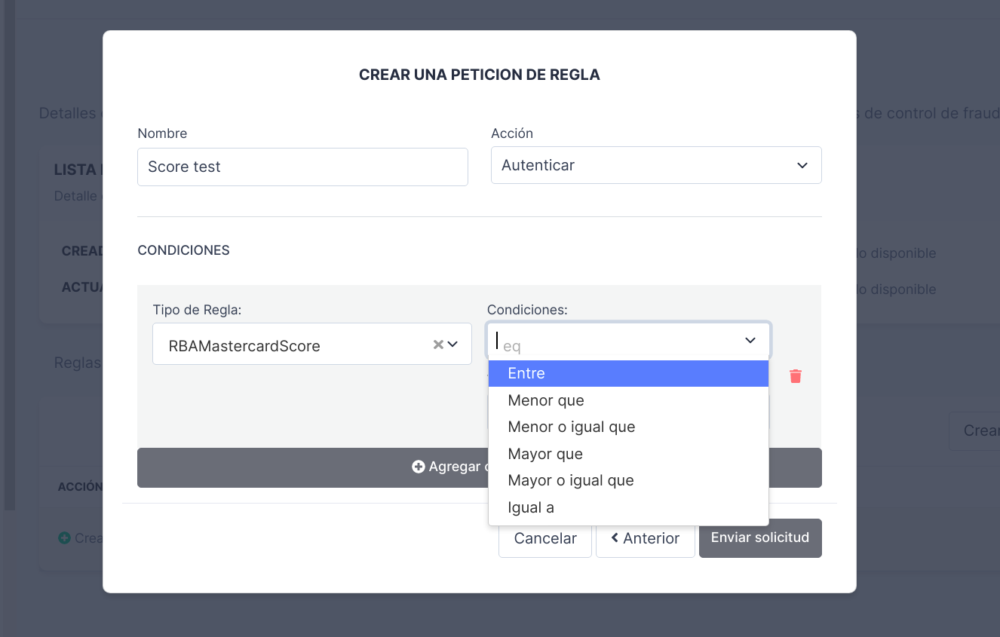

Luego de enviar la solicitud de regla, esta se agregará al listado de *Solicitudes de regla*, allí tiene la opción de *Aceptar* o *Denegar*, con los botones de la parte lateral derecha.

> Hasta que no acepte la solicitud de regla, esta no podrá visualizarse ni utilizarse en producción. Luego de aceptarla recuerde habilitarla.

### Acciones de las reglas: 
Al crear una regla se le define un tipo de acción específica que va a ejecutar. Estas acciones permiten definir el transStatus (estado de autenticación de la transacción). Las acciones permitidas son las siguientes:

- **Autenticar:** Las reglas que contengan esta acción, permitirán validar la solicitud de autenticación y aprobarla automáticamente, generando un estatus Y (autenticación satisfactoria). Por ejemplo una regla de tipo *BinRange* va a contener un rango mínimo y máximo de BIN, las tarjetas cuyo BIN entren en este rango, podrán ser autenticadas automáticamente, creando una especie de lista blanca de datos.

- **Realizar desafío:** Las reglas cuya acción es realizar desafío, al validarse generarán el estatus C (requiere desafío), con este estatus el tarjetahabiente será direccionado a una interfaz de usuario en la cual se le pedirá aceptar un desafío para validar su identidad. 

- **Desafío desacoplado:** Las reglas que contengan esta acción, al validarse generarán un estatus D y la petición de autenticación se pondrá en pausa y el emisor se encargará de realizar el desafío manualmente con el tarjetahabiente.
 
- **No autenticar:** Las reglas con acción de no autenticar, al cumplirse la validación, lanzarán automáticamente un estado *N* (Autenticación fallida). Los datos incluídos en estas reglas se conciben con un alto grado de riesgo o posible fraude. Las reglas con esta acción pemriten crear un tipo de lista negra de datos.

- **Ejecutar un grupo:** Las reglas creadas con esta acción pueden ejecutar todo las reglas contenidas en otro grupo de reglas del emisor.

- **Ninguno:** Las reglas con esta acción, tomarán la acción por defecto y generarán un estatus N (No autenticado).

> La función de ejecutar un grupo de reglas permitirá hacer validaciones no secuenciales entre los diferentes grupos registrados para un emisor.

### Listas de control de fraude:

Las listas de control de fraude

Para crear una lista de control se direccionará a un formulario como este:

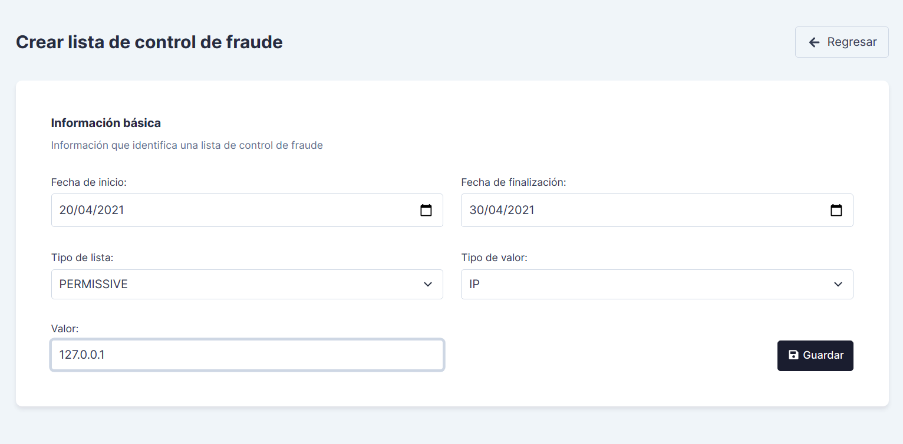

Se solicitará:

- **Fecha de inicio:**
- **Fecha de finalización:**
- **Tipo de lista:** ACS dispone de dos tipos de listas:
    - PERMISSIVE
    - RESTRICTIVE
- **Tipo de valor:**
- **Valor:**    

<!--
type: tab
title: Importes
-->

# Importes de rangos de tarjetas

En esta sección se pueden visualizar las importaciones de archivos realizadas en ACS, por ejemplo se encuentran los archivos que importan un listado de rangos de tarjetas para un emisor.

En este índice de importes puede visualizar los detalles de cada importe y el estado en el cual se encuentra la importanción.

Los estados posibles son:

- Completado
- Fallido
- Pendiente

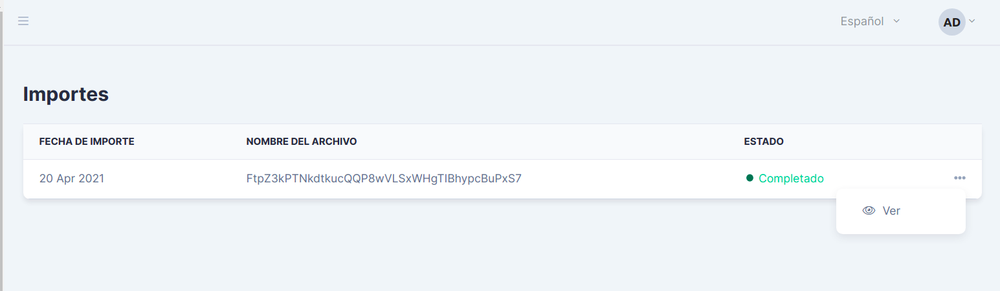

<!--
type: tab
title: Reportes
-->

# Reportes

Los reportes son archivos que contienen registros de las autenticaciones procesadas por ACS. La siguiente imagen muestra un ejemplo de la vista con el índice de reportes generados. Estos reportes se pueden ver y descargar.

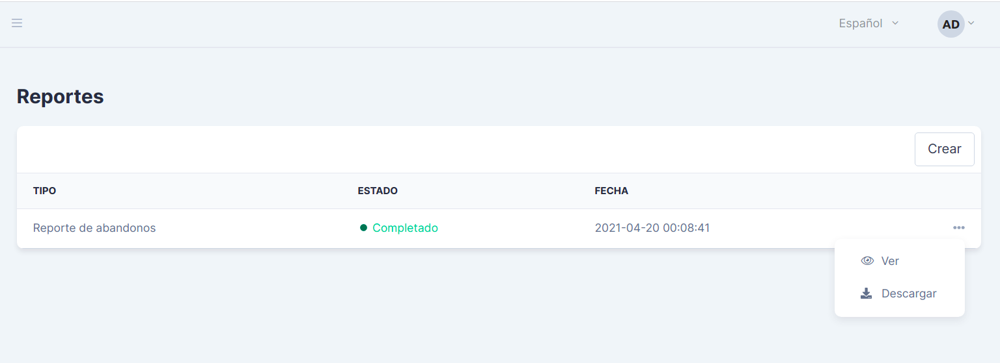

Para crear un nuevo reporte haga clic en el botón *Crear*. 
Actualmente se manejan dos tipos de reportes:

## Reportes de Autenticaciones

El sistema de reportes permite generar un archivo con el reporte de las autenticaciones procesadas por ACS. Para el reporte se puede definir un rango de fechas, identificador de la transacción, BIN de tarjetas, banco emisor y uno o varios estados de las autenticaciones que se desean registrar en el reporte. El siguiente es un ejemplo de creación de un reporte de autenticaciones:

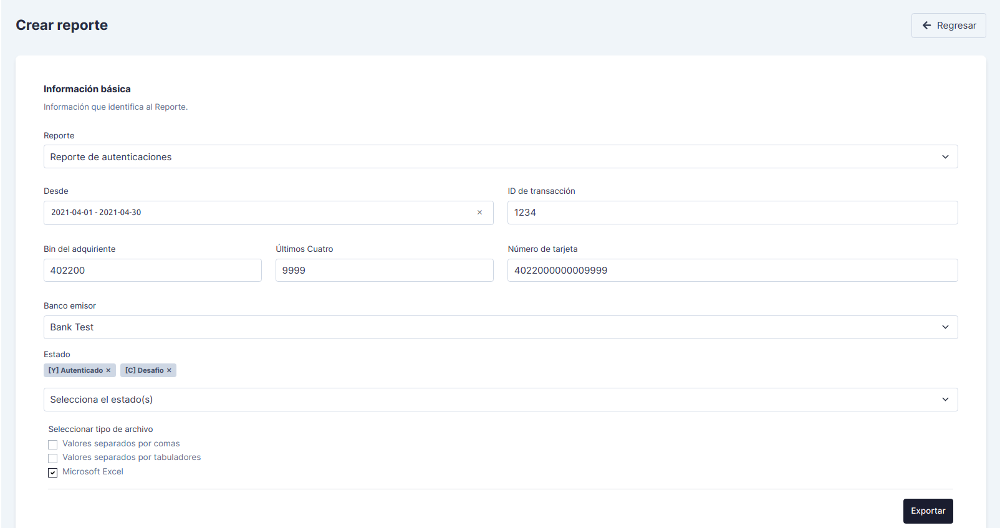

## Reportes de Abandonos 

Con este reporte se generan los datos de las autenticaciones que son abandonadas en el ACS. Para el reporte se puede definir un rango de fechas y el banco emisor. El siguiente es un ejemplo de creación de un reporte de abandonos:

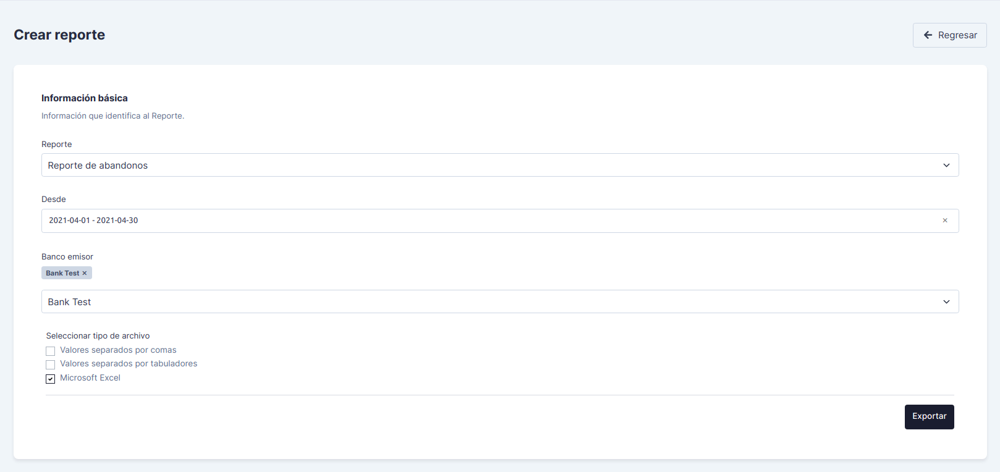

## Tipos de archivos generados para los reportes
- Archivo separado por comas.
- Archivo separado por tabuladores.
- Archivo de Excel

<!--
type: tab
title: Franquicias
-->

# Franquicias

Aquí se gestionan las franquicias que funcionan en ACS, siendo la franquicia una compañía aliada con los bancos emisores de tarjetas de crédito, las cuales proveen diversos beneficios bancarios a sus clientes.

En esta sección se visualiza el listado de franquicias, los detalles de cada una, se pueden editar, habilitar y deshabilitar.

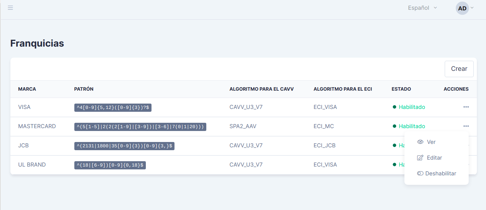

Para crear una franquicia, haga clic en el botón crear y diligencia los datos teniendo en cuenta la siguiente información:

- **Marca,** Nombre de la franquicia, por ejemplo Matercard, VISA...

- **Patrón,** Se ingresa un patrón basado en una expresión regular, con este se valida que el número de tarjeta que llegue al ACS, sea válido según los estándares propios de cada franquicia.

- **Algoritmo para el CAVV,** El Cardholder Authentication Verification Value (CAVV), es un valor de verificación de autenticación del titular de la tarjeta. Aquí se debe seleccionar un algoritmo que valide este valor, el cual resulta de hacer una transacción. En el momento ACS cuenta con un algoritmo para VISA y otro para MASTERCARD.

- **Algoritmo para el ECI,** El Electronic Commerce
Indicator (ECI), es un valor para indicar los resultados del intento de autenticación. En ACS hay tres algoritmos disponibles, para las franquicias de VISA, MASTERCARD y JCB.

- **Logo,** Puede adjuntar una imagen con el logo de la franquicia.

En la siguientes imagen se puede visualizar un ejemplo de creación de franquicia:

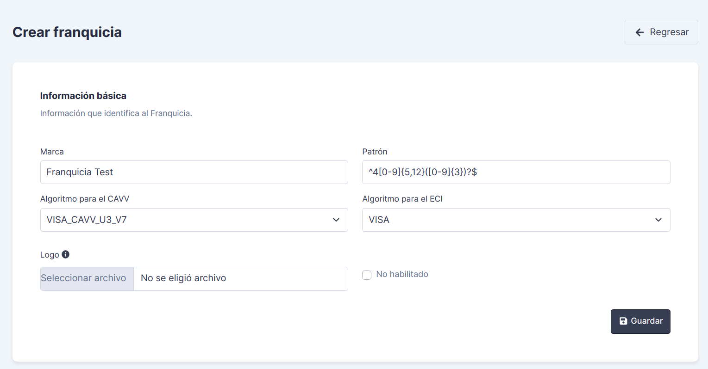

<!--
type: tab
title: Certificados
-->

# Certificados SSL

En esta sección se crean los certificados SSL, los cuales son títulos digitales que vinculan digitalmente una clave criptográfica con los datos de una organización. Los certificados SSL permiten autenticar la identidad de un sitio web y cifrar la información que se envía al servidor.
El certificado permite que cuando un usuario intente enviar información de las credenciales al servidor web, el navegador del usuario accede al certificado digital del servidor y establece una conexión segura. De esta forma, estos certificados proveen en esencia seguridad de los datos manejados en ACS.

La siguiente imagen muestra un ejemplo de la vista de un índice de certificados:

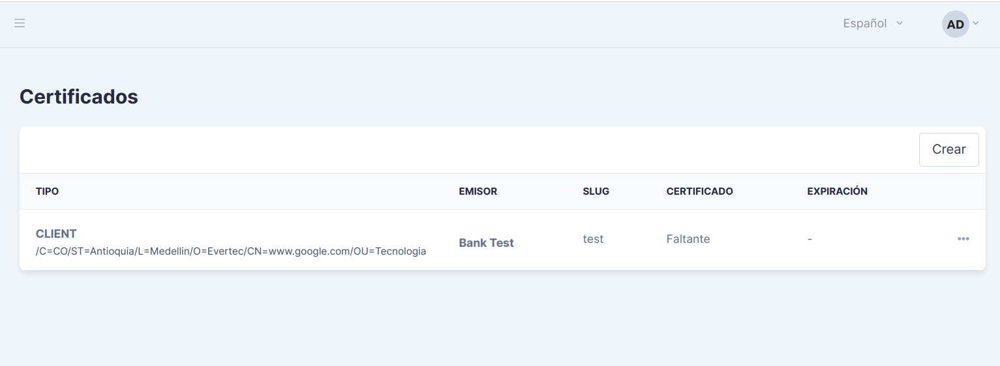

Los certificados se pueden editar y visualizar los detalles del mismo. 

## Creación de un certificado:

Para crear un nuevo certificado haga clic en el botón *Crear*. La solicitud o creación del certificado consta de tres partes:

#### 1. Creación de la llave privada:

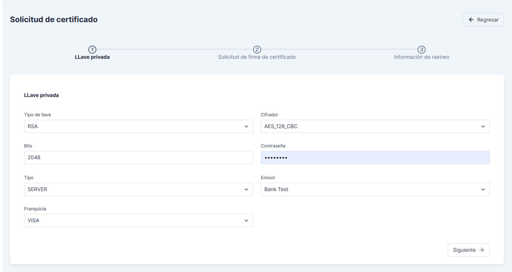

1.1. Solicitud del tipo de llave con el cual se va a cifrar el certificado, están disponibles los siguientes tipos de llaves:

- **RSA,** es una llave creada a partir del algoritmo RSA, un sistema criptográfico de clave pública que utiliza factorización de números enteros y cifra bloques de datos. Es el algoritmo más utilizado para crear estas llaves.

> Una llave privada solo puede descifrarla la llave pública que se crea y que es asociada a una única llave privada.

- **EC,** es una llave basada en la Criptografía de curva elíptica (ECC), la cual promete una seguridad más fuerte y mejor rendimiento ya que utiliza claves más cortas. El sistema criptográfico utilizado está basado en las matemáticas de curvas elípticas.

> La llave es la que permite al usuario autenticarse por medio de la conexión SSH al servidor web. Para esto deberá contar con una llave privada y una llave pública que contiene el servidor y con la cual se va a conectar. 

1.2. Selección del tipo de cifrador para el certificado. Se debe seleccionar dependiendo del tipo de conexión y están disponibles dos tipos:

- **AES_128_CBC:** Es un tipo de cifrado, donde Advanced Encryption Standard (AES), es un esquema de cifrado por bloques y Cipher Block Chaining (CBC), es un modo de operación para una unidad de cifrado por bloques. Este tipo de cifrado tiene un tamaño de 128 bytes. Es el más utilizado.

- **AES_256_CBC:** Es un tipo de cifrado por bloques, que utiliza el modo de operación CBC. Este tipo de cifrado tiene un tamaño de 256 bytes.

3. Tamaño de la llave en bits.

4. Contraseña de la llave.

5. Tipo de llave. La llave va a funcionar para un cliente, un servidor o un SDK.

6. Banco emisor.

7. Tipo de franquicia.

#### 2. Solicitud de firma del certificado:

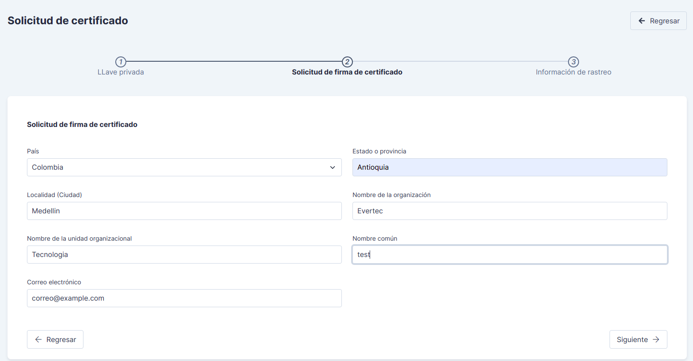

Aquí se registran los datos de información general sobre el solicitante de la llave:

- Ubicación.
- Organización.
- Nombre, debe ser un dominio.
- Correo electrónico.

#### 3. Información de rastreo:

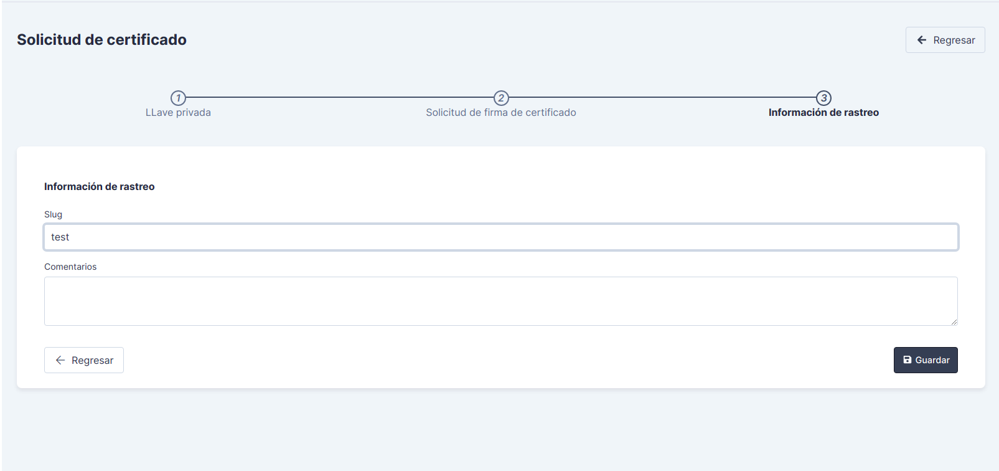

Permite la identificación a partir de un slug, el cual forma parte de la URL que se va a consultar para acceder al servidor mediante el certificado.

## Registro y firma del certificado:

Una vez creado el certificado, le mostrará los datos que diligenció en el formulario. Además, de eso creará una solicitud de firma de certificado, como la siguiente:

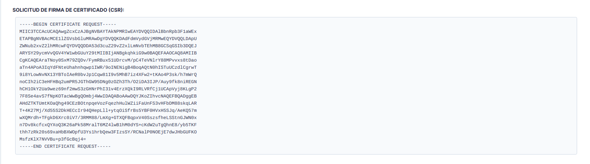

Debe copiar este bloque incluidas las etiquetas de BEGIN y END CERTIFICATE REQUEST. Con esta información debe proceder a crear su llave privada y a firmar el certificado.

Una vez tenga su certificado firmado, obtendrá otro bloque similar al de la imagen, debe copiarlo incluyendo también las etiquetas de BEGIN y END CERTIFICATE REQUEST.

Luego, en el detalle del certificado, al final encontrará la opción de registrar su certificado:

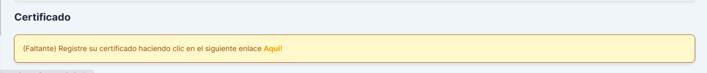

Haga clic allí, lo llevará a la siguiente vista, donde debe pegar su certificado en el campo *Certificado*, así:

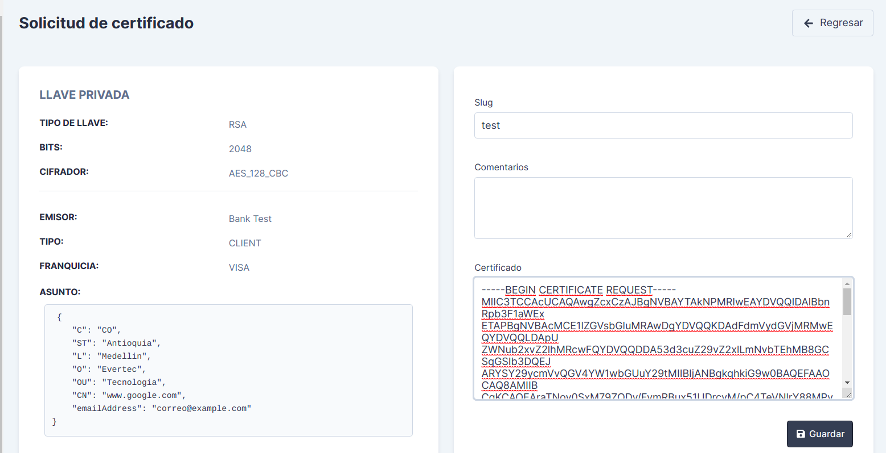

<!--
type: tab
title: Roles
-->

# Roles

Aquí se gestionan los roles de usuario de la aplicación. Inicialmente se tiene una vista con la lista de roles creados, los cuales se pueden ver, editar y eliminar. Ademáss se pueden crear nuevos roles diligenciando un nombre y opcionalmente una descripción para el mismo.

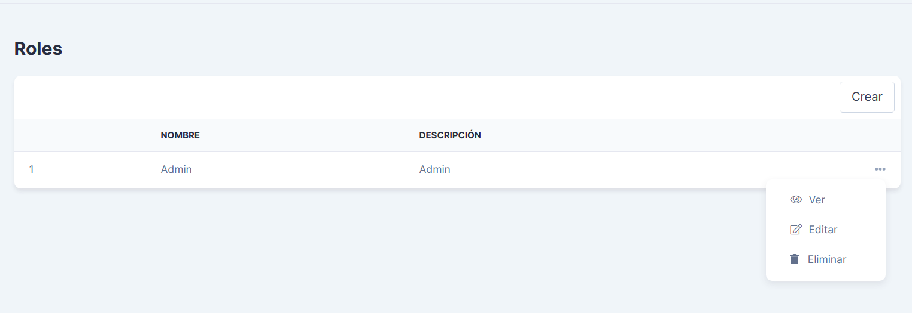

### Asignación de permisos:

Al dar clic en la opción *Ver* de un rol, se presentarán los detalles del rol seleccionado y en la parte inferior de la pantalla encontrará un menú como el siguiente:

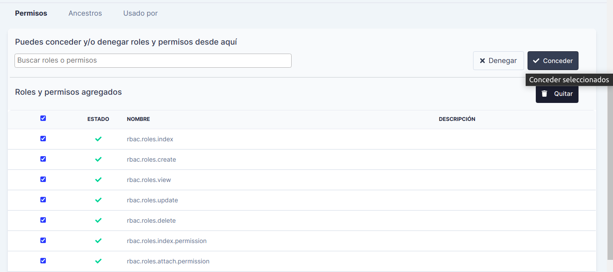

Aquí puede buscar permisos referentes a diversas funcionabilidades de ACS, seleccionarlos, denegarlos y concederlos. Estos permisos determinan a qué funcionabilidades y acciones tiene acceso el rol específico.

# Perfiles

Los roles se asocian con los perfiles. El siguiente es un ejemplo de un índice de perfiles, en el cual puede ver, editar, habilitar o deshabilitar un perfil, haciendo clic en el menú lateral derecho. 

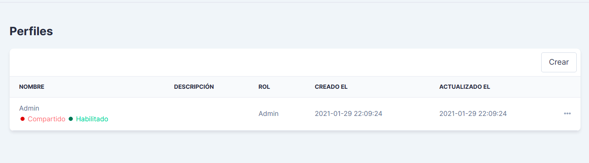

Para crear un nuevo perfil se solicitará:

- Nombre para el perfil.
- Descripción (opcional).
- Rol, debe seleccionar el rol que se asociará al perfil.
- Compartido, puede habilitar o deshabilitar esta opción.

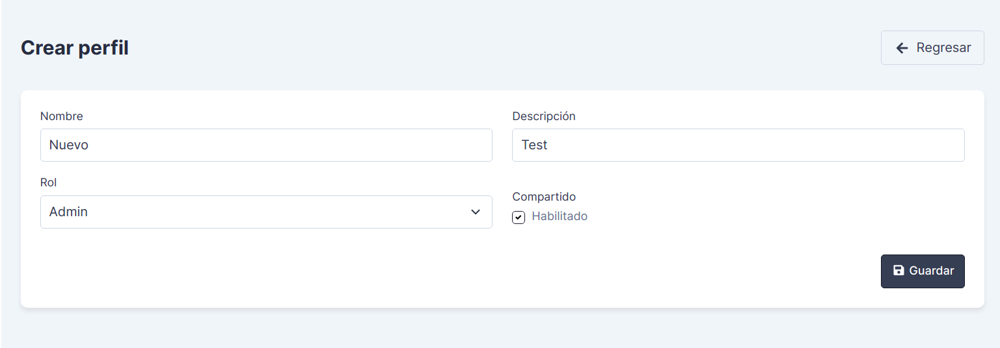

<!--
type: tab
title: Logs
-->

# Logs de Seguridad

En esta sección se registran los movimientos y actualizaciones que se realizan en la aplicación de ACS. Los logs permiten tener un control de los cambios y de lo que sucede en la aplicación. 
En la sección de logs se encuentra un listado de los mismos,con una descripción y la fecha y hora en que fue registrado el movimiento. Un ejemplo de un índice de logs es el siguiente:

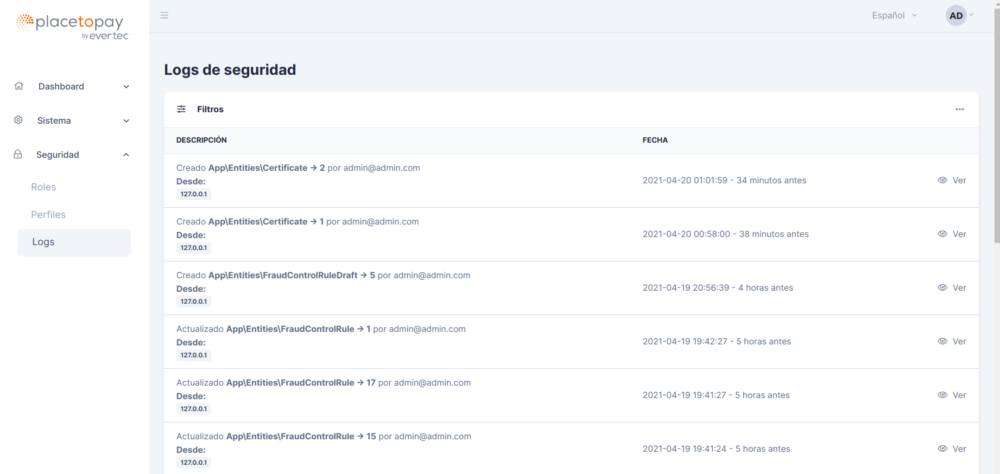

En los detalles de cada log, puede visualizar el usuario que realizó el movimiento, la dirección IP, el sistema operativo y un detalle del cambio con un antes y después.

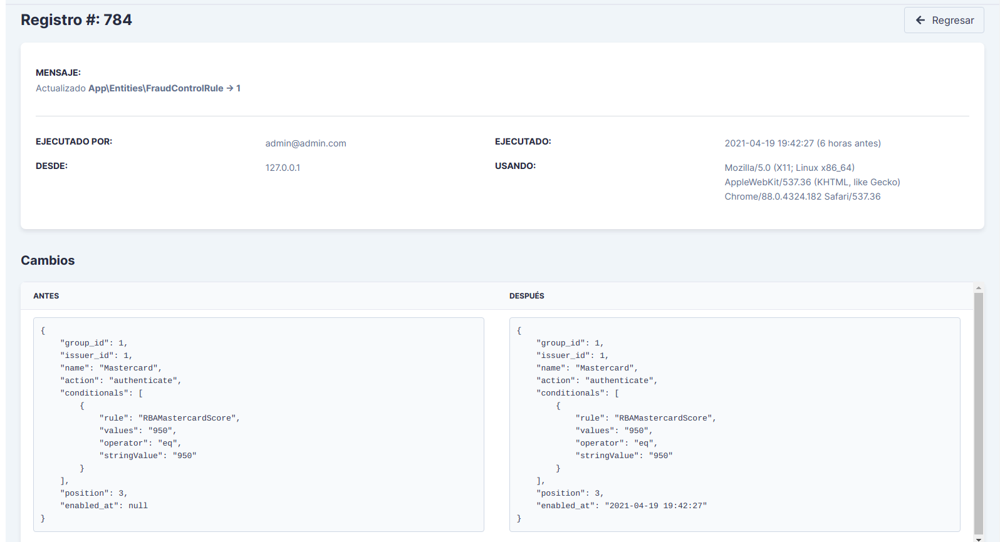

Para esta funcionabilidad también están disponibles los filtros de búsqueda por rango de fechas y usuario. Además, se pueden eliminar, exportar en un reporte de logs,  visualizar y descargar los reportes de logs creados.

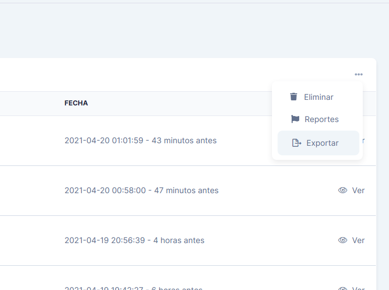

### Filtros:

Puede hacer búsquedas de logs registrados. Puede filtrar por rango de fechas y por el correo electrónico del usuario que realizó el cambio o movimiento:

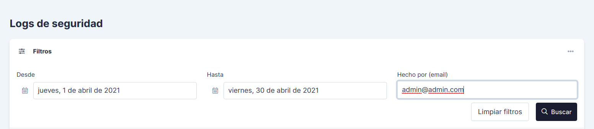

<!-- type: tab-end -->

