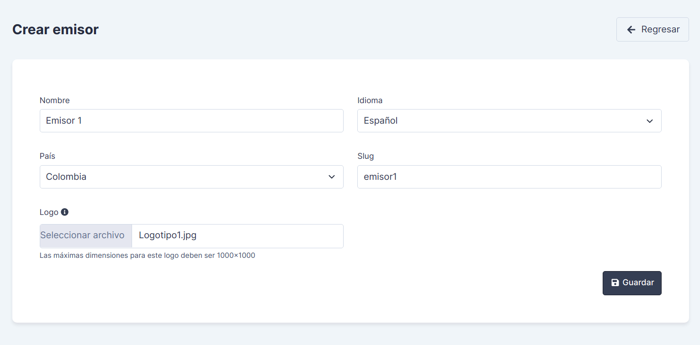
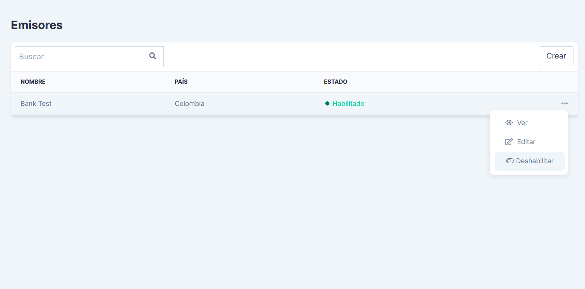
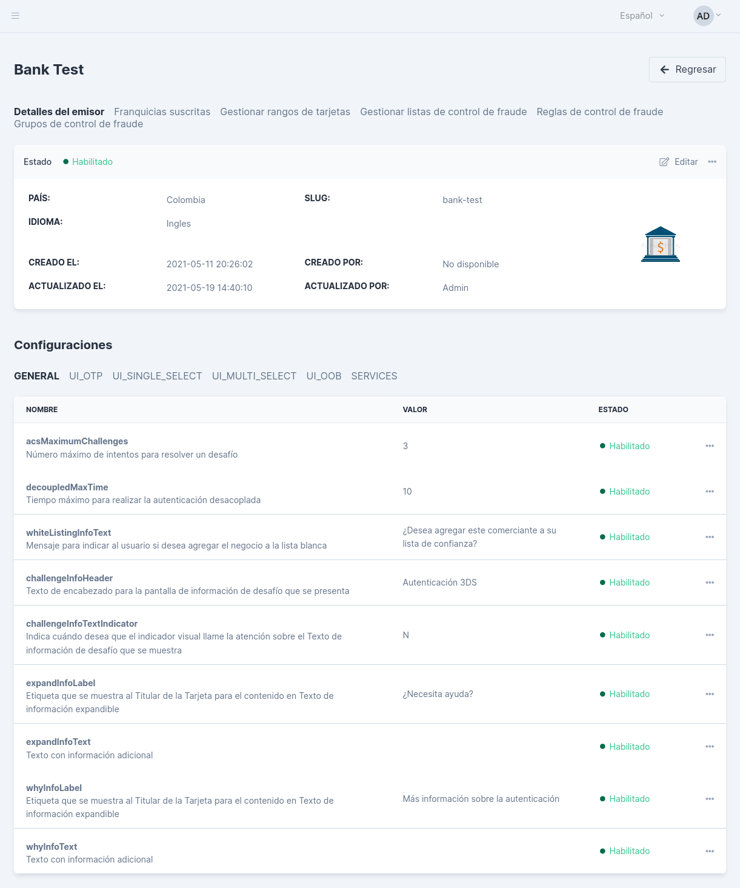
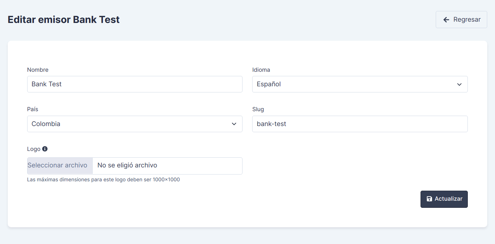
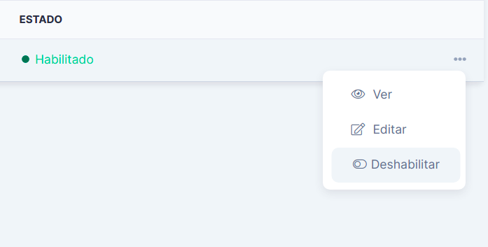
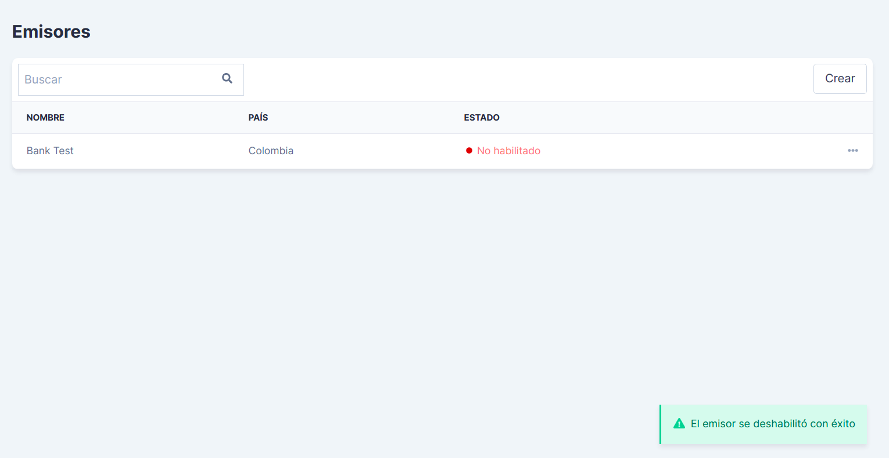
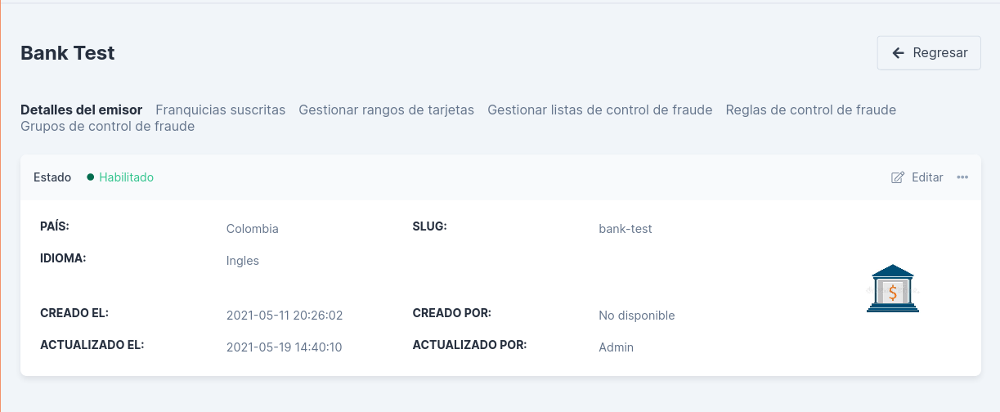

<!--
type: tab
title: Generalidades del emisor
-->

# Emisores en ACS

## ¿Qué es un emisor?

Un emisor o banco emisor, es la institución financiera responsable de emitir los medios de pago, como tarjetas de débito o de crédito. Estas tarjetas de pago se emiten con la marca de la asociación de tarjetas o franquicia. También pueden existir emisores de tarjetas de pago propias y no franquiciadas.

Entre las funciones de un emisor están:

- El emisor tiene la responsabilidad de autorizar o denegar una transacción cuando recibe los datos de la compra. 

- El emisor se encarga de transferir el dinero de una compra hecha por el consumidor, al adquiriente, que a su vez es quien paga al comercio y mantiene relación con este. 

- El emisor debe dar el mantenimiento requerido a cuentas y tarjetas.

- El emisor es responsable de resolver cargos disputados a su favor, por motivos de fraudes o riesgos.

- El emisor se encarga de activar, suspender y bloquear una tarjeta de pago cuando se requiera.

## ¿Cómo acceder a la gestión de emisores de ACS?

Para acceder al listado de emisores de la aplicación siga los siguientes pasos:

1. Remítase al menú lateral izquierdo dónde visualizará tres opciones, "Dashboard", "Sistema" y "Seguridad", como muestra la siguiente imagen:

2. Haga clic en el menú "Sistema", se desplegará un listado de opciones, haga clic en la opción "Emisores".

3. Visualizará una pantalla similar a la siguiente:

## ¿Cómo crear un emisor en ACS?

Para crear un emisor, haga clic en el botón Crear ubicado en la parte lateral derecha del índice de emisores.

Visualizará un formulario similar al siguiente:

Para diligenciarlo tenga en cuenta los siguientes datos:

- **Nombre:** Ingrese en este campo el nombre del banco emisor que va a crear.

- **Idioma:** Seleccione de la lista desplegable el idioma principal con el cual desea que se procesen las autenticaciones para los usuarios.

- **País:** Seleccione de la lista desplegable el país dónde opera el banco emisor.

- **Slug:** Ingrese una cadena clave para el emisor. Esta cadena se agregará a las URL donde se gestionen configuraciones y servicios del emisor.

- **Logo:** Aquí puede cargar una imagen con el logo del emisor. Para hacerlo haga clic en la opción *Seleccionar archivo* y busque la imagen correspondiente al logo en su equipo. La imagen debe tener unas dimensiones máximas de 1000x1000.

## ¿Cuáles son los requerimientos para crear un emisor en ACS?

Para crear y configurar un emisor en ACS, este debe haber emitido tarjetas de pago con las franquicias que ya hayan sido certificadas para funcionar en ACS.

Se requiere que el país y el idioma con el cual se vaya a crear el emisor, estén disponibles para ACS.

Se requiere que exista una relación entre emisor, adquiriente y comercio y que estos estén registrados en las aplicaciones de ACS y de MPI de PlacetoPay Evertec, para lograr un proceso de autenticación exitosa. 

> En este punto es importante recordar que la aplicación de **MPI** también implementa y pertenece al flujo propuesto por el protocolo 3-D Secure para autenticar un tarjetahabiente.
Pertenece al dominio el adquiriente y entre sus funciones principales están:
  >> - Recibir y responder la petición de autenticación enviada por el comercio o pasarela de pagos.
  >> - Solicitar al emisor la autorización del pago.
  >> - Responder al comercio o pasarela de pagos el estado final de la autenticación.

## Índice de emisores

En esta sección se visualiza el listado o índice de emisores, la información se presenta en una tabla donde se muestran los datos principales de cada emisor, tales como: Nombre, País y Estado. 

### Acciones disponibles para los emisores:

En el título "Acciones" ubicado en la parte lateral derecha del índice de emisores, se encuentra un menú con tres puntos,haga clic en este menú y despliegue las acciones o funcionalidades disponibles para cada emisor. En el menú se encuentran las siguientes acciones:

- **Ver:** Seleccione esta opción para visualizar los detalles del emisor, sus configuraciones y componentes.

  Visualizará una vista similar a la siguiente:

- **Editar:** Seleccione esta opción para actualizar o corregir los datos con los cuales creó el emisor. 

  Visualizará un formulario similar al de creación del emisor. Todos los datos son editables.

- **Habilitar o Deshabilitar:** Deslice el botón tipo switch para habilitar el emisor si se encuentra deshabilitado o para deshabilitarlo cuando se encuentre habilitado. 

Al habilitar o deshabilitar, la aplicación le entregará un mensaje de confirmación similar al siguiente e inmediatamente cambiará el estado del emisor editado.

## Detalles de un emisor

### Información principal del emisor:

En la siguiente imagen se visualiza un ejemplo de la parte superior de la vista de *Detalles de un emisor*. Se visualiza la información con la cual se creó el emisor, el estado en que se encuentra el emisor (está habilitado o no),las fechas de creación del emisor y de actualización y los usuarios que hicieron la creación y/o la actualización.

En la parte lateral derecha hay un recuadro en el cual se debe mostrar el logo de la franquicia, para este ejemplo no se cargó una imagen, por lo cual se muestra en negro.

Además, en la parte lateral derecha, hay un botón para acceder al formulario de edición en caso de requerirlo.

En la parte superior derecha de la vista actual, se encuentran pestañas que permiten acceder a otros menús de configuración de un emisor, los cuales se revisarán más adelante.

### Configuraciones del emisor:
En la parte inferior de la vista del detalle de un emisor, se encuentra la sección correspondiente a la gestión de configuración de campos del emisor.

Puede ver los detalles de cada campo, qué función desempeña,puede editarlos, deshabilitarlos y habilitarlos según se requiera. 

También, en la pestaña *Services*, se encuentran las estrategias disponibles para ejecutar los servicios para el emisor.

- otpStrategy, información acerca de cómo se va a implementar el servicio del OTP (Autenticación con contraseña de un solo uso).

- cardholderStrategy, información acerca de cómo se va a implementar el servicio de información del tarjetabiente.

#### Campos de configuración:

Estas configuraciones se gestionan desde la sección *Campos de configuración* del ACS. Allí se encuentra un listado de los campos creados para configurar los emisores, puede habilitarlos, deshabilitarlos, editarlos y ver sus detalles.

Además, con el botón *Crear*, puede adicionar nuevos campos con diferentes tipos de datos a recibir:

- **SELECT:** Recibe un dato que se ha seleccionado de una lista de valores disponibles.

- **BOOLEAN:** Recibe únicamente las opciones de falso y verdadero.

- **DATE:** Recibe una fecha con un formato dado.

- **NUMERIC:** Recibe valores numéricos.

- **STRING:** Recibe un dato que puede incluir cadena de texto, números y signos.

- **PASSWORD:** El dato que se recibe en este campo es guardado de forma segura. SU valor original suele reemplazarse con carácteres especiales o con un algoritmo de criptografía.

- **TRANSLATABLE:** Recibe un dato que puede ser traducido.

### Gestión de rangos de tarjetas:
En esta sección se importan y crean los rangos de tarjetas aceptadas para un emisor específico. Puede ver los detalles de cada rango, editarlos y eliminarlos.

Al dar clic en el botón *Crear*, se desplegarán dos opciones para crear rangos:

- **Crear un rango de tarjetas,** este permite crear un rango de forma manual, se solicitará el BIN para el rango, el cual debe ser de 8 dígitos, el valor inicial y el final, la franquicia y la clase o tipo de las tarjetas asociadas al rango.

- **Crear importación,** para crear una importación visualizará un formulario similar al siguiente:

Debe seleccionar la franquicia para la cual se van a cargar los rangos y un archivo de tipo CSV (archivo de valores separados por comas) que contenga la información de los rangos. Un ejemplo del archivo es este:

El archivo debe contener cuatro títulos separados por comas en minúscula:

1. **start_range**: Indica el valor inicial para el rango de tarjetas.

2. **end_range**: Indica el valor final para el rango de tarjetas.

3. **class**: Hace referencia a la clase o tipo de tarjeta utilizada, por ejemplo si es Gold, Platinum.

4. **action**: Debe indicar qué acción se debe ejecutar para el rango indicado, las acciones posibles y sus indicadores son los siguientes:

    **I**: Indicador para acción de insertar rango.

    **U**: Indicador para acción de actualizar rango .

    **D**: Indicador para acción de eliminar rango.

Estos títulos deben seguirse de sus respectivos valores en filas hacia abajo, igualmente separados por comas, sin espacios.

> Para visualizar el formato de un archivo CSV de ejemplo, haga clic en la opción *Descargar* que aparece en el lado izquierdo del formulario.

### Gestión del control de fraude:
Estas funcionalidades están descritas detalladamente en la sección de *Motor Antifraude*. Aquí se hace la gestión de las reglas y de los grupos donde están contenidas, las cuales permiten validar los datos que llegan al ACS y garantizar la seguridad de la información, lo cual permitirá aceptar las solicitudes de autenticación que sean realmente válidas y tener filtros que permitan optimizar este proceso de validación.

<!--
type: tab
title: Motor Antifraude
-->

# Motor de Control de Fraude

La principal funcionalidad de ACS es el motor de control antifraude, este permite validar la información que se recibe en la petición de autenticación, a través de un conjunto de reglas que validan las autenticaciones de cada emisor registrado.

Esta funcionalidad se gestiona desde la sección de Emisores de la aplicación.

### Listas de control de fraude:

Las listas de control de fraude son el primer filtro que puede validar una autenticación. Estas listas son temporales y se dividen en dos clases:

- **Permisivas:** Estas listas van a crear un filtro que va a permitir que las autenticaciones que cumplan con los valores registrados en estas, puedan eximirse de la ejecución de los grupos de reglas y continúe con el proceso de autenticación.

- **Restrictivas:** Por el contrario, este tipo de listas, al evaluar que los datos de la autenticación coinciden con los datos de la lista, enviará las autenticaciones directamente a evaluar los grupos de reglas.

> Las listas de control antifraude se ejecutan antes de los grupos de control antifraude y según los resultados que obtenga de sus validaciones, puede evitar que una autenticación tenga que pasar por las validaciones de los grupos de reglas.

Para crear una lista de control se direccionará a un formulario como este:

Se solicitará:

- **Fecha de inicio:** Fecha en la que se va a iniciar la validación de la lista de reglas.

- **Fecha de finalización:** Fecha en la que se va a finalizar la validación de la lista de reglas.

- **Tipo de lista:** ACS dispone de dos tipos de listas:
    - PERMISSIVE
    - RESTRICTIVE

- **Tipo de valor:** Aquí se selecciona el parámetro por el cual se van a hacer los filtros de las autenticaciones. 

- **Valor:** Corresponde al valor del tipo de parámetro seleccionado en el campo anterior. Con este valor se procede a hacer las validaciones y a verificar la coincidencia del dato con los recibidos en la autenticación.

### Grupos de control antifraude:

Para cada banco emisor registrado en el ACS, se creará un grupo predeterminado conformado por una serie de reglas antifraude que permiten validar las solicitudes de autenticación. Además de este grupo prederteminado, se podrán agregar otros nuevos al emisor.

En la imagen se muestra el listado de grupos de control de fraude de un emisor. En esta vista se pueden crear nuevos grupos con el botón *Crear* y se pueden visualizar los detalles y las reglas de cada grupo dando clic en la opción *Ver*.

En la imagen ejemplo, se visualizan dos grupos, uno llamado *Lista blanca*, donde se podrían incluir por ejemplo números de tarjetas y datos de clientes con bajo riesgo de fraude y las acciones de las reglas podrían ser en su mayoría *Autenticar*. El otro grupo se llama *Lista negra*, aquí se podrían agregar los números de tarjeta e información personal asociada a clientes con historiales o reportes y la acción de las reglas podría ser *No autenticar*.

### Reglas antifraude:

Los grupos de control antifraude están conformados por reglas que permiten hacer las validaciones de los datos recibidos en las autenticaciones. Estas reglas evalúan la coincidencia de las condiciones contenidas en la regla y de los datos obtenidos en la solicitud de autenticación.

Al presionar la opción *Ver* de un grupo de control antifraude, le mostrará una vista similar a esta.

Aquí se encuentran los detalles del grupo seleccionado, puede habilitarlo o deshabilitarlo en el menú lateral derecho. Además, encontrará el listado de reglas correspondientes al grupo, la acción que ejecutan, puede habilitarlas o deshabilitarlas y puede visualizar los detalles y condiciones de la misma.

En la pestaña *Solicitudes de reglas*, se pueden visualizar las peticiones de creación, actualización o eliminación de reglas, las cuales se encuentran pendientes por aprobar o denegar. También, puede crear una petición de reglas nueva, haciendo clic en el botón *Crear petición de regla*.

Luego visualizará una ventana como esta, dónde le solicitan la acción que desea hacer con la regla.

Para crear una petición de regla, debe seleccionar la opción *Crear*, y se desplegará una vista como la siguiente:

Los datos requeridos son:
- **Nombre:** ¿Cómo desea nombrar la regla a crear?
- **Acción:** Se refiere a la función que va a cumplir la regla en el proceso de autenticación. Estas acciones se describen detalladamente en el siguiente título.
- **Tipo de regla:** Hace referencia al tipo de regla que desea crear, por ejemplo es una regla que valida números de tarjeta de crédito, o valida emails, o rangos de bines...
- **Valor:** Es el valor que requiere una regla para validar y comparar los datos presentes en la misma y en la solicitud de autenticación.

> Puede además agregar otras condiciones para una misma regla.

También hay otros tipos de reglas que ofrecen más posibilidades, en la siguiente imagen puede visualizar una regla donde puede escoger que el valor tenga un rango, un valor mínimo o máximo por ejemplo.

Luego de enviar la solicitud de regla, esta se agregará al listado de *Solicitudes de regla*, allí tiene la opción de *Aceptar* o *Denegar*, con los botones de la parte lateral derecha.

> Hasta que no acepte la solicitud de regla, esta no podrá visualizarse ni utilizarse en producción. Luego de aceptarla recuerde habilitarla.

### Acciones de las reglas: 
Al crear una regla se le define un tipo de acción específica que va a ejecutar. Estas acciones permiten definir el transStatus (estado de autenticación de la transacción). Las acciones permitidas son las siguientes:

- **Autenticar:** Las reglas que contengan esta acción, permitirán validar la solicitud de autenticación y aprobarla automáticamente, generando un estatus Y (autenticación satisfactoria). Por ejemplo una regla de tipo *BinRange* va a contener un rango mínimo y máximo de BIN, las tarjetas cuyo BIN entren en este rango, podrán ser autenticadas automáticamente, creando una especie de lista blanca de datos.

- **Realizar desafío:** Las reglas cuya acción es realizar desafío, al validarse generarán el estatus C (requiere desafío), con este estatus el tarjetahabiente será direccionado a una interfaz de usuario en la cual se le pedirá aceptar un desafío para validar su identidad. 

- **Desafío desacoplado:** Las reglas que contengan esta acción, al validarse generarán un estatus D y la petición de autenticación se pondrá en pausa y el emisor se encargará de realizar el desafío manualmente con el tarjetahabiente.
 
- **No autenticar:** Las reglas con acción de no autenticar, al cumplirse la validación, lanzarán automáticamente un estado *N* (Autenticación fallida). Los datos incluídos en estas reglas se conciben con un alto grado de riesgo o posible fraude. Las reglas con esta acción pemriten crear un tipo de lista negra de datos.

- **Ejecutar un grupo:** Las reglas creadas con esta acción pueden ejecutar todo las reglas contenidas en otro grupo de reglas del emisor.

- **Ninguno:** Las reglas con esta acción, tomarán la acción por defecto y generarán un estatus N (No autenticado).

> La función de ejecutar un grupo de reglas permitirá hacer validaciones no secuenciales entre los diferentes grupos registrados para un emisor.

<!-- type: tab-end -->