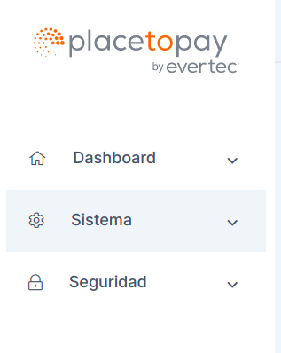
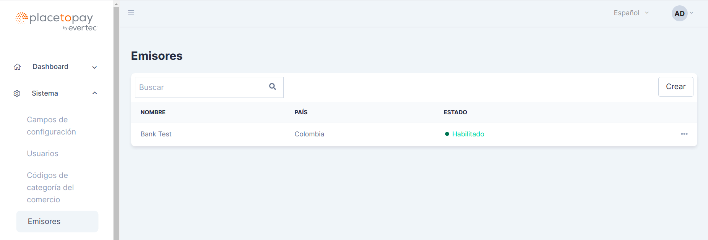

# Emisores en ACS

## ¿Qué es un emisor?

Un emisor o banco emisor, es la institución financiera responsable de emitir los medios de pago, como tarjetas de débito o de crédito. Estas tarjetas de pago se emiten con la marca de la asociación de tarjetas o franquicia. También pueden existir emisores de tarjetas de pago propias y no franquiciadas.

Entre las funciones de un emisor están:

- El emisor tiene la responsabilidad de autorizar o denegar una transacción cuando recibe los datos de la compra. 

- El emisor se encarga de transferir el dinero de una compra hecha por el consumidor, al adquiriente, que a su vez es quien paga al comercio y mantiene relación con este. 

- El emisor debe dar el mantenimiento requerido a cuentas y tarjetas.

- El emisor es responsable de resolver cargos disputados a su favor, por motivos de fraudes o riesgos.

- El emisor se encarga de activar, suspender y bloquear una tarjeta de pago cuando se requiera.

## ¿Cómo acceder a la gestión de emisores de ACS?

Para acceder al listado de franquicias de la aplicación siga los siguientes pasos:

1. Remítase al menú lateral izquierdo dónde visualizará tres opciones, "Dashboard", "Sistema" y "Seguridad", como muestra la siguiente imagen:

2. Haga clic en el menú "Sistema", se desplegará un listado de opciones, haga clic en la opción "Emisores".

3. Visualizará una pantalla similar a la siguiente:

## ¿Cómo crear una emisor en ACS?
