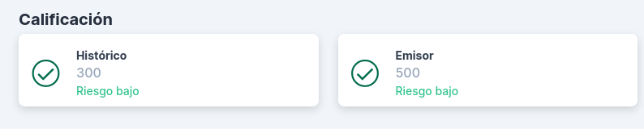
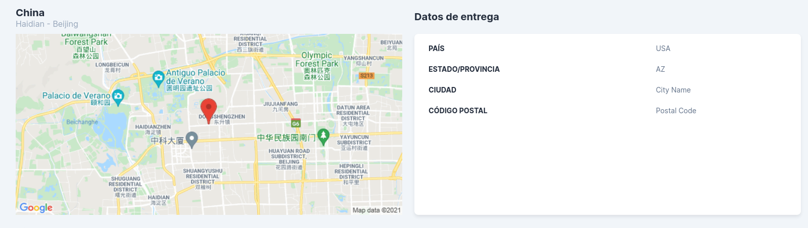
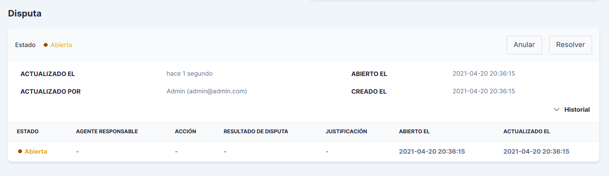
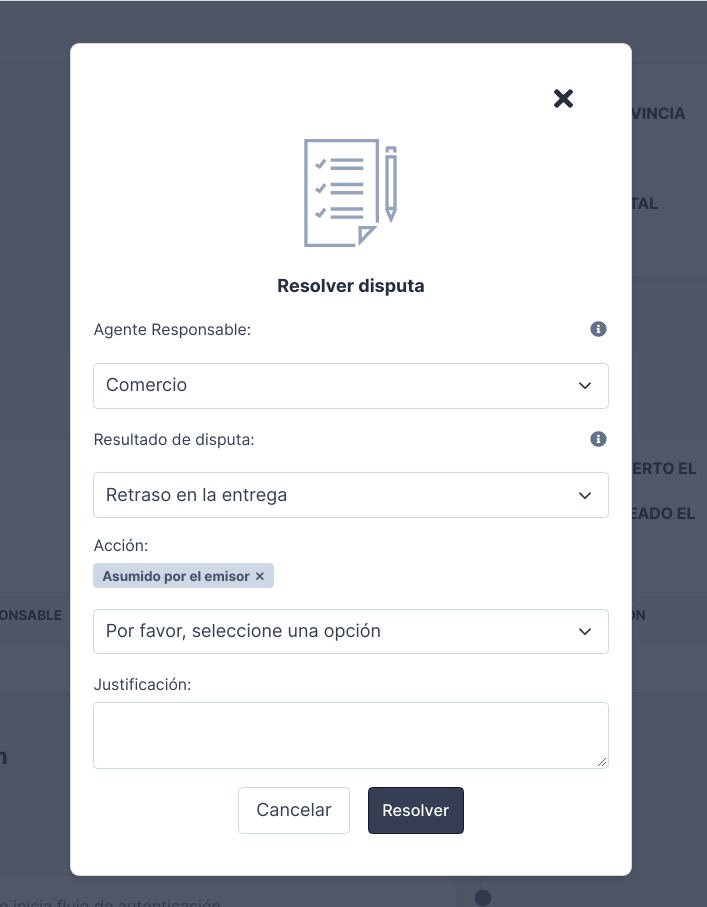
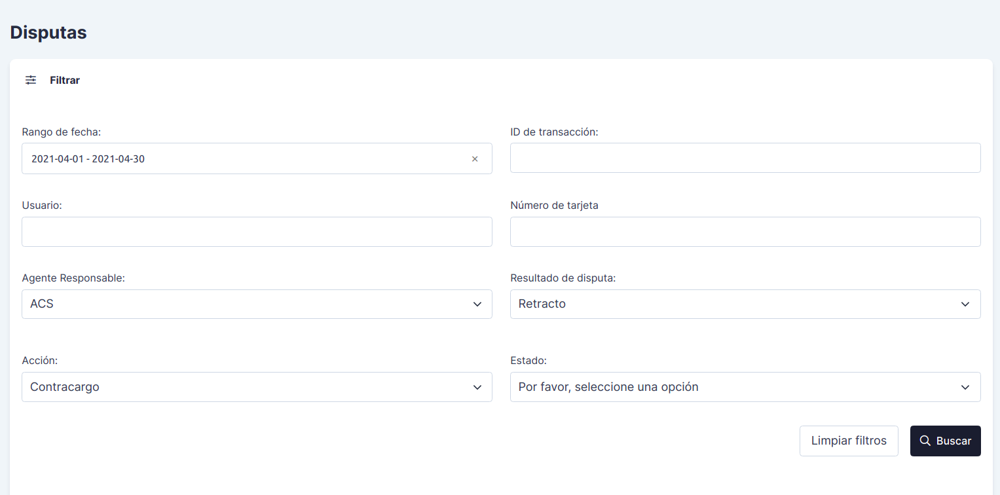
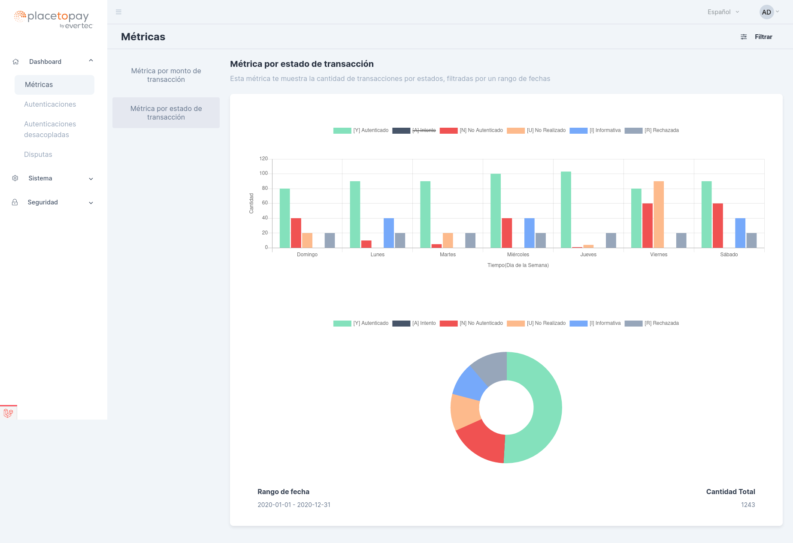

<!--
type: tab
title: Autenticaciones
-->

# Autenticaciones

En este módulo se registra la información de todas las autenticaciones procesadas por el ACS. En la primera vista se encuentra el listado de las transacciones, con fecha,estado y otros datos importantes. También, puede desplegar más información de cada transacción con el botón desplegable ubicado antes del botón *Ver*.

## Filtros:

Para buscar un listado o una transacción en específico puede utilizar los filtros. ACS cuenta con dos tipos de filtros para las autenticaciones, uno básico y otro avanzado para hacer consultas más rigurosas.

Para acceder a la funcionabilidad, dé clic en el botón *Filtrar* ubicado en la parte lateral superior izquierda de la vista:

#### Filtros básicos:

La búsqueda se hace por:

- **Rango de fecha:** Debe dar clic en una fecha inicial del calendario y luego en otra fecha posterior a la primera, luego dé clic en el botón negro para guardar el rango de fechas.

- **ID de la transacción:** Aquí se registra el identificador único de la transacción.

#### Filtros avanzados:

Al desplegar los filtros básicos, hay una opción *Ver filtros avanzados*, seleccionela y se desplegará una vista como la siguiente:

Aquí además de los dos filtros básicos, se pueden agregar más datos de búsqueda, tales como:

- BIN
- Últimos 4 dígitos del número de tarjeta
- Número de tarjeta
- Banco emisor
- Estado de la transacción

## Detalle de la autenticación:

En el detalle de la autenticación, el cual se puede visualizar dando clic en el botón *Ver* de una autenticación, se encuentra información esencial del proceso de autenticación, como el estado de la autenticación, la información básica de la transacción, la información del tarjetahabiente, del comercio, los datos de entrega y una línea de tiempo con los detalles de todo el proceso de autenticación y de la información captada por cada uno de los mensajes presentes en el proceso y correspondientes al protocolo 3-D Secure.

### Calificación:

Algunas autenticaciones cuentan con calificaciones que permiten darle un puntaje de seguridad. Este puntaje determina el nivel de riesgo de la transacción, teniendo en cuenta el historial de transacciones que poseen características similares.

### Información de entrega:

Aquí se visualiza la información relacionada con la ubicación en la cual se va a entregar el bien o servicio adquirido con la transacción. También, se puede visualizar un mapa con la ubicación.

### Gestión de disputas:

Las disputas son reclamaciones que realiza el cliente registrado con una autenticación en ACS, en la cual puede existir un caso de fraude. 

Para crear una disputa, al inicio de la vista del detalle de la autenticación, haga clic en el botón *Generar nueva disputa*, posterior a esto se agregará a la autenticación un caso de disputa abierta, el detalle de la disputa se puede visualizar en el detalle de la autenticación:

En el detalle se puede desplegar el historial de la disputa con su respectivo estado. También, haciendo clic en el botón *Anular*, se despliega una ventana para que ingrese el motivo de la anulación de la disputa. Por el contrario, al dar clic en el botón *Resolver*, se presentará un formulario como el siguiente, en el cual debe registrar los motivos para la resolución de la disputa.

Diligencie el formulario teniendo en cuenta los siguientes datos:

- **Agente responsable:** Hace referencia al agente responsable de la causa que originó la disputa.

- **Resultado de disputa:** Este resultado se basa en la respuesta que ofrecen las instituciones encargadas de evaluar la disputa. Si el resultado dado no registra en la lista de opciones, debe elegir la opción *Otro* y describir el resultado al que se refiere.

- **Acción:** Aquí se debe seleccionar el agente que se va a hacer cargo de los resultados de la disputa.

### Traza de la autenticación:

Cada autenticación tiene una traza, la cual se entiende en ACS como una línea secuencial que registra los pasos realizados en el proceso de autenticación, los datos que recibe, las peticiones y respuestas de los tipos de mensaje que procesa, los estados y descripción de errores si se presentan.

Este es un ejemplo de una traza de una autenticación exitosa:

Además, cada paso tiene la opción *Ver más*, la cual muestra la estructura de la petición o la respuesta con sus respectivos datos. Un ejemplo de este detalle es el siguiente:

<!--
type: tab
title: Disputas
-->

# Disputas

Como se menciona en el módulo de Autenticaciones, las disputas son reclamaciones que realiza un cliente por un posible caso de fraude en una transacción.

En esta sección se registran y listan las disputas que se procesaron para diversas autenticaciones. 

Aquí se pueden visualizar los detalles y descargar las disputas como un PDF.

### Reporte de disputas:

El archivo PDF generado para una disputa contiene el estado y el historial de la disputa, información básica de esta, información del tarjetahabiente, las trazas o pasos de la autenticación con sus respectivas peticiones y respuestas.

### Filtros:

Este módulo contiene también filtros que permitirán hacer búsquedas de disputas específicas, filtrando por agentes responsables de las disputas, acciones, identificadores de transacción, entre otros.

<!--
type: tab
title: Autenticaciones Desacopladas
-->

# Autenticaciones Desacopladas

En esta sección registran las autenticaciones que entraron a un proceso de desafío desacoplado a cargo del banco emisor para corroborar la identidad del tarjetabiente. 
Se detalla la fecha, el emisor, el BIN, número de tarjeta, monto y tiempo restante para la aprobación de la autenticación. Aquí se da la opción de resolver las autenticaciones manualmente, con base en el análisis de la información dada.

La siguiente es un ejemplo de vista inicial para la sección de autenticaciones desacopladadas:

<!--
type: tab
title: Métricas
-->

# Métricas

Las métricas son estadísticas que reportan el comportamiento de la aplicación conforme al flujo de transacciones procesadas.

## Filtros:

Para mostrar en la gráfica de la métrica los datos específicos que se requieran, se debe hacer un filtro de las autenticaciones. Para acceder a los filtros haga clic en el botón *Filtrar*, ubicado en la parte superior lateral izquierda.

Para filtrar las transacciones se requieren los siguientes datos:

- Rango de fecha, seleccione una fecha inicial y una posterior en el calendario. Luego de clic en el botón negro para guardar el rango.

- Periodo.

- Moneda, divisa utilizada para las transacciones.

- Emisor, banco emisor que por el cual se procesó el grupo de transacciones.

ACS cuenta actualmente con los siguientes dos tipos de métricas:

## Métricas por monto de transacción

Esta métrica muestra en una gráfica el monto de las transacciones procesadas por el ACS, filtradas por un rango de fechas y diferenciadas por el estatus obtenido en la autenticación.

## Métricas por estado de transacción

Esta métrica muestra en una gráfica la cantidad de transacciones procesadas por el ACS, filtradas por un rango de fechas y diferenciadas por el estatus obtenido en la autenticación. 

Un ejemplo de métrica por estado de transacción, se presenta a continuación:

En la parte inferior puede visualizarse el rango de fecha con el cual se obtuvo la métrica y la cantidad de transacciones que cumplieron con los filtros.

> Para generar nuevas métricas, haga clic en el botón *Limpiar filtros* y genera un nuevo rango de fechas, moneda y emisor.

<!-- type: tab-end -->

