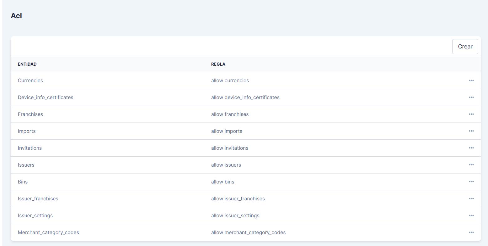
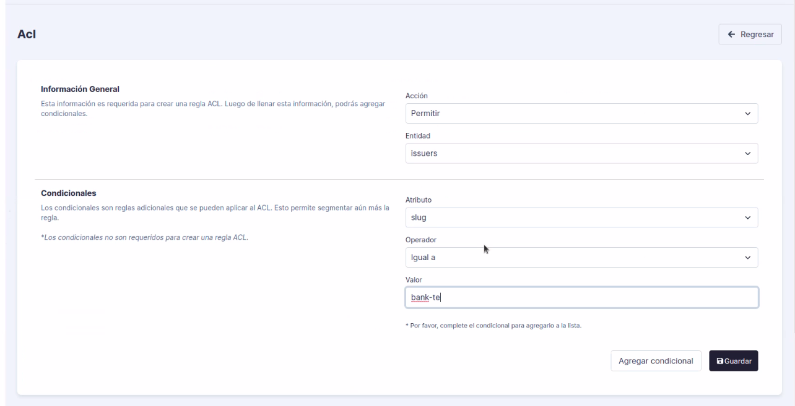

<!--
type: tab
title: Roles
-->

# Roles

Aquí se gestionan los roles de usuario de la aplicación. Inicialmente se tiene una vista con la lista de roles creados, los cuales se pueden ver, editar y eliminar. Además, se pueden crear nuevos roles diligenciando un nombre y opcionalmente una descripción para el mismo.

### Asignación de permisos:

Al dar clic en la opción *Ver* de un rol, se presentarán los detalles del rol seleccionado y en la parte inferior de la pantalla encontrará un menú como el siguiente:

Aquí puede buscar permisos referentes a diversas funcionabilidades de ACS, seleccionarlos, denegarlos y concederlos. Estos permisos determinan las funcionabilidades y acciones a las cuales tiene acceso el rol.

### Roles ancestros:

Aquí registran los roles que están utilizando el rol actual. Esto puede darse cuando se le concede un rol a otro rol en el menú de *Permisos*.

<!--
type: tab
title: Perfiles
-->

# Perfiles

Los roles se asocian con los perfiles. El siguiente es un ejemplo de un índice de perfiles, en el cual puede ver, editar, habilitar o deshabilitar un perfil, haciendo clic en el menú lateral derecho. 

Para crear un nuevo perfil se solicitará:

- Nombre para el perfil.
- Descripción (opcional).
- Rol, debe seleccionar el rol que se asociará al perfil.
- Compartido, puede habilitar o deshabilitar esta opción. Un perfil compartido se da cuando el perfil está siendo utilizado por otros roles.

### ACL:

El ACL (Access Control List), es un módulo de gestión de permisos y reglas desarrollado en PlacetoPay y utilizado por ACS. Este se encarga de gestionar los permisos y accesos de los diferentes roles y perfiles creados en ACS. 

Estos permisos y reglas de acceso, se diferencian de los permisos básicos registrados en los roles, en que estos son más específicos y ofrecen una capa de seguridad extra a los datos manejados en la aplicación, ya que estos permisos permiten que se visualice la información que corresponde solo a un cliente en específico y que no se filtre otra información que pertenece a otros clientes u organizaciones.

La lista de reglas se puede visualizar en el detalle de un perfil, en una vista similar a la siguiente:

### Crear reglas ACL:

Para crear una regla ACL, haga clic en el botón *Crear*, se presentará un formulario como el siguiente:

#### Información general:

Las reglas tienen dos opciones disponibles:
- Permitir accesos
- Denegar accesos

En el campo entidad, debe seleccionar el la entidad que gestional el módulo al cual quiere aplicarle las condiciones que va a crear.

#### Condicionales:

- Atributo: Seleccione el campo correspondiente a la entidad seleccionada previamente y al cual desea validar.

- Operador: Permite hacer las comparaciones de los datos.

- Valor: Ingrese uno o varios valores que debería contener el atributo seleccionado.

<!--
type: tab
title: Logs
-->

# Logs de Seguridad

En esta sección se registran los movimientos y actualizaciones que se realizan en la aplicación de ACS. Los logs permiten tener un control de los cambios y de lo que sucede en la aplicación. 
En la sección de logs se encuentra un listado de los mismos, con una descripción, la fecha y hora en que fue registrado el movimiento. 

Un ejemplo de un índice de logs es el siguiente:

### Acciones:

Para visualizar las acciones disponibles para el listado de los logs, haga clic en el menú ubicado en la parte superior lateral derecha y se desplegarán las siguientes acciones:

- **Eliminar:** Esta opción eliminará toda la lista de logs registrados. 

- **Reportes:** Redirecciona al listado de reportes de logs que se han exportado.

- **Exportar:** Exportará un documento en el cual registran todos los logs listados.

### Detalles de un log:

Puede visualizar los detalles de cada log haciendo clic en el botón *Ver*, ubicado al final de cada registro. Allí puede visualizar el usuario que realizó el movimiento, la dirección IP, el sistema operativo y un detalle del cambio con un antes y después.

### Filtros:

Para hacer búsquedas de los logs registrados utilice la sección de filtros. Haga clic en el botón *Filtros*, ubicado en la parte lateral izquierda, se desplegará un módulo para filtrar por rango de fechas y por el correo electrónico del usuario que realizó el cambio o movimiento:

<!-- type: tab-end -->